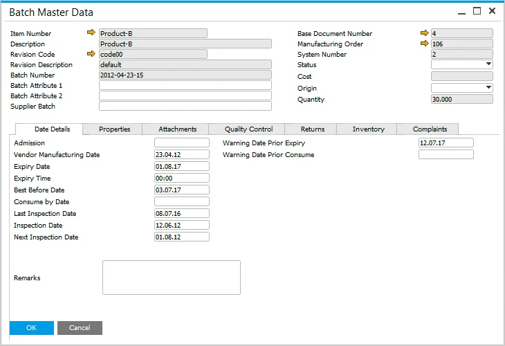

# Date Details tab

In SAP Business One integrated with CompuTec ProcessForce, the Date Details tab within the Batch Master Data form allows users to manage critical batch-related dates, ensuring effective tracking and quality control throughout the product lifecycle.

---

On this tab, you can set details about Batch dates, e.g., date of admission, expiry, consumption, and inspection dates.

    

- **Admission**: the date when the batch enters the warehouse. For manufactured items, this is the production date, while for purchased items, it corresponds to the Goods Receipt PO date.
- **Vendor Manufacturing Date**: the production date provided by the vendor for purchased items.
- **Expiry Date, Consume by Date, Inspection Dates**: these dates help maintain batch validity and quality control. Learn more about their calculation [here](../batch-control-settings/extended-batch-expiry-evaluation.md).
- **Best Before Date**: indicates the date before which the product retains its highest quality, commonly used in the food industry. This field is manually set.

---
