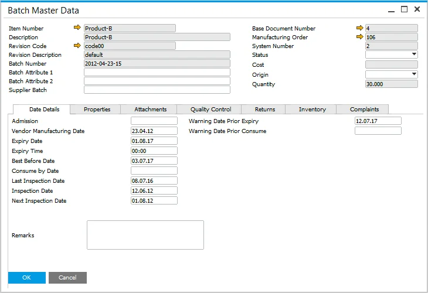

# Overview

In SAP Business One integrated with CompuTec ProcessForce, the Batch Details form and the CompuTec ProcessForce Batch Master Data details have been unified into a single, comprehensive interface. This consolidation streamlines navigation, allowing users to access batch information directly from all SAP Business One and CompuTec ProcessForce documents and reports.

:::note
When adding User Defined Fields (UDFs) to the SAP Business One Batch Details Table, it's essential to replicate these UDFs - maintaining the same names and formats - in the CompuTec ProcessForce Batch Master Data tables and the Pick Receipt: Picked Items table
:::

---

To access the Batch Master Data form, navigate through:

:::info Path
    Item Management → Batches → Batch Master Data
:::

The Batch Master Data form comprises several tabs, each serving a specific function:

- [Date Details](/docs/processforce/user-guide/inventory/batch-control/batch-master-data/details-tab/): Manages batch-related dates, such as admission, expiry, and inspection dates.
- [Properties](/docs/processforce/user-guide/inventory/batch-control/batch-master-data/properties-tab/): Displays properties defined in the Item Details for the specific item.
- Attachments: allows users to upload, view, or delete files associated with a specific batch. Users can also link a Business Partner to the file and include certificate numbers and dates, particularly for attaching certificate documents.
- [Quality Control](/docs/processforce/user-guide/inventory/batch-control/batch-master-data/quality-control-tab/):  provides an overview of quality control status, actions, and a history of quality control tests related to the batch, including associated complaints and non-conforming materials reports.
- [Returns](/docs/processforce/user-guide/inventory/batch-control/batch-master-data/returns-tab/): a list of return documents connected to a specific Batch Master Data record. Click [here](returns-tab.md) to find out more.
- [Inventory](/docs/processforce/user-guide/inventory/batch-control/batch-master-data/batch-inventory-tab/): displays the total quantity of the batch along with all storage locations where items from the batch are stored.
- Complaints: provides a list of all complaints recorded against the batch, along with pertinent information.

    

---
