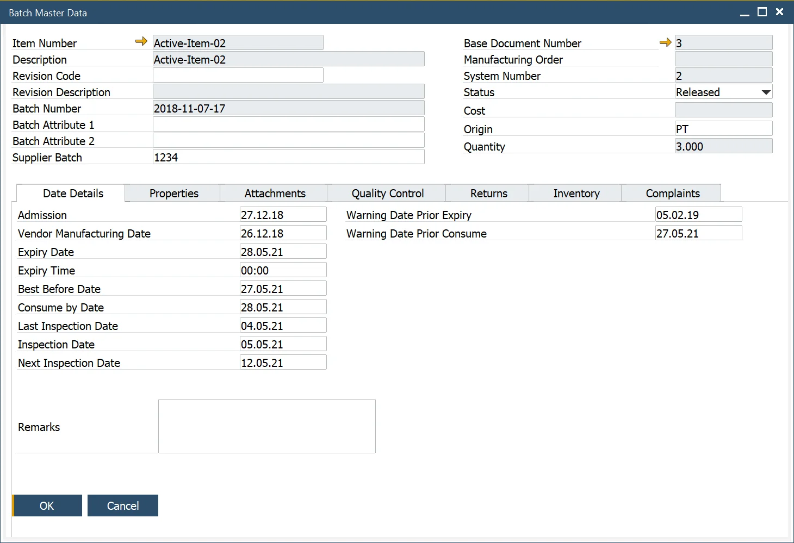

# Overview

Batches are collections of identical products and serve as the foundation for traceability. This functionality enables tracking raw materials at every stage of production and monitoring products during distribution. Traceability is essential for ensuring quality control and facilitating swift recall processes when necessary.

---

The SAP Business One Batch Details form and the CompuTec ProcessForce Batch Master Data form have now been merged into a single, unified interface. All relevant SAP Business One and CompuTec ProcessForce documents and reports will navigate to this consolidated form for improved efficiency.

>**Note**: When adding User-Defined Fields (UDFs) to the SAP Business One Batch Details Table, ensure that the same UDFs (with identical names and formats) are also added to the CompuTec ProcessForce Additional Batch Tables.

:::info Path
Inventory → Item Management → Batches
:::

---
