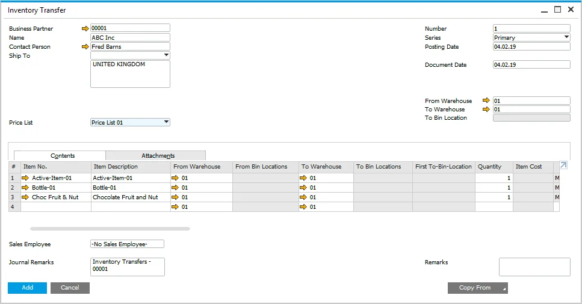
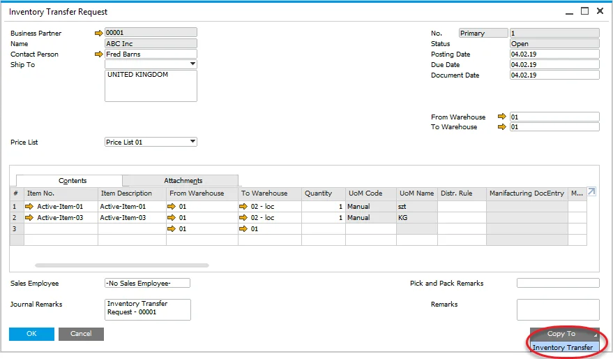
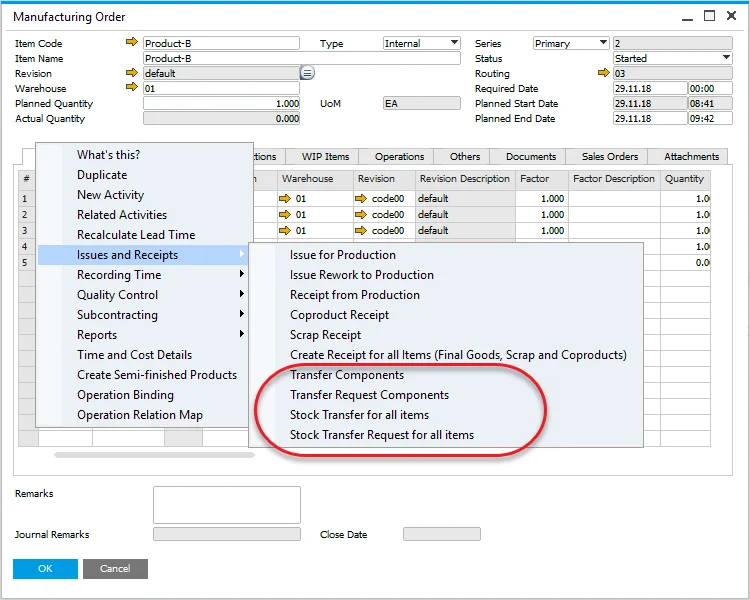
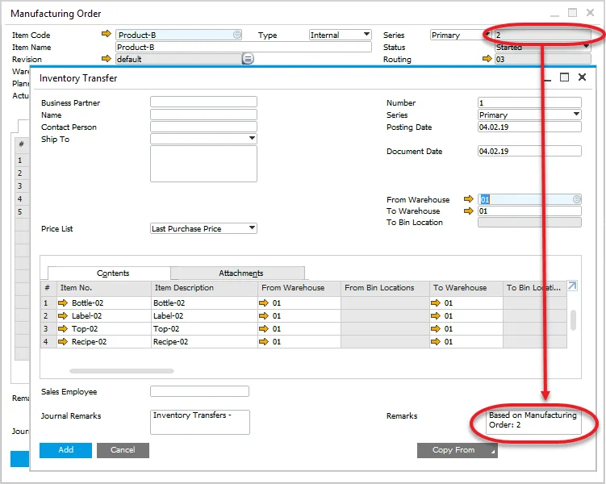

# Inventory Transfer Request and Inventory Transfer

Effective inventory management is crucial for smooth business operations. SAP Business One provides two key documents - Inventory Transfer Request and Inventory Transfer - to facilitate efficient stock movement between warehouses. These documents help businesses manage their inventory flow accurately and efficiently.

---

:::info Path
    Inventory > Inventory Transactions
:::

## Inventory Transfer

:::info Path
    Inventory → Inventory Transactions → Inventory Transfer
:::

Inventory Transfer is a document used to record the physical movement of inventory from one warehouse to another. It ensures that stock levels are updated correctly, maintaining accuracy in inventory management.

## Inventory Transfer Request

:::info Pathc
    Inventory → Inventory Transactions → Inventory Transfer Request
:::

Unlike Inventory Transfer, an Inventory Transfer Request is a preliminary document that records a planned inventory movement without executing it. It allows businesses to plan stock transfers before committing to them. Once approved, the request can be copied to an Inventory Transfer document to complete the process.

## Manufacturing Order Based Document

Both Inventory Transfer and Inventory Transfer Requests can be linked to a Manufacturing Order. From the Manufacturing Order's context menu, users can generate these documents either for specific components or for all items in the order. This linkage ensures seamless integration between production and inventory management.

A document generated from a Manufacturing Order will reference it in the Remarks field for traceability.

---
