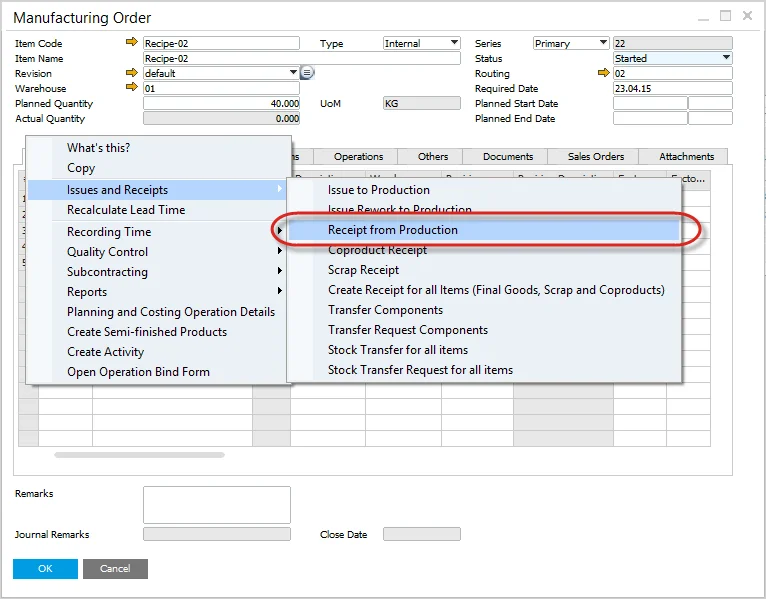
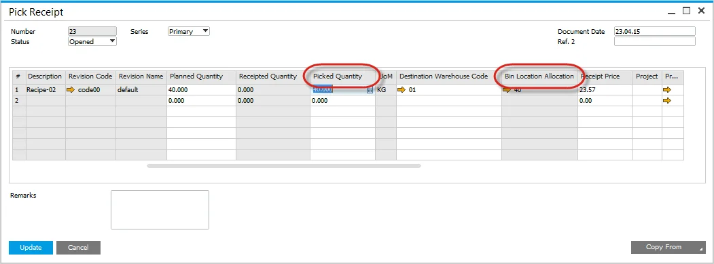
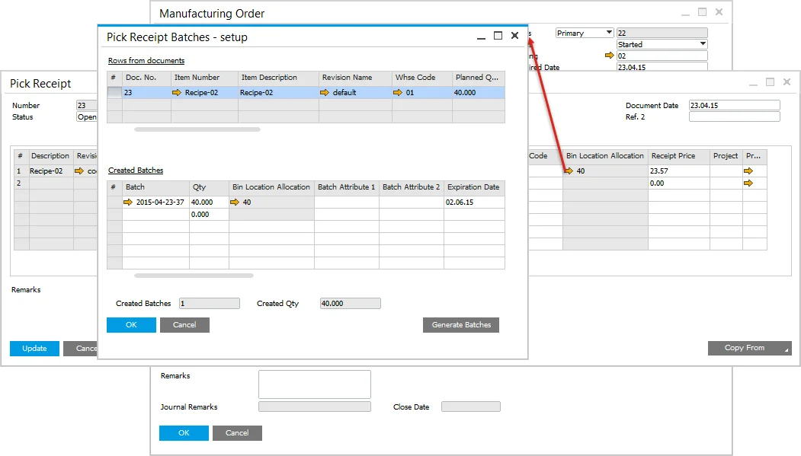
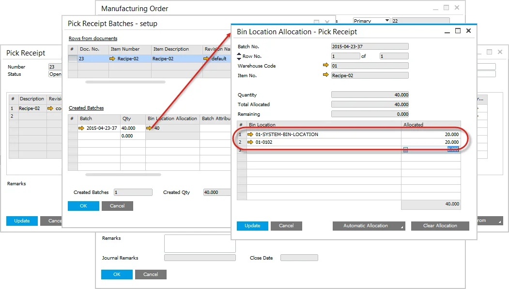
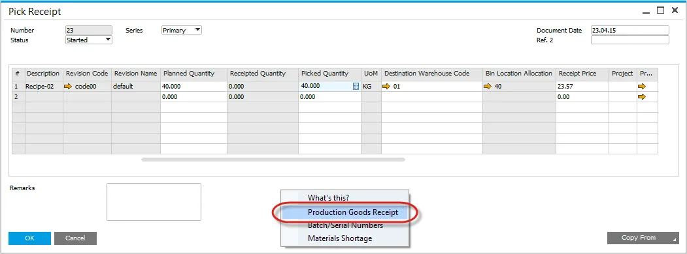
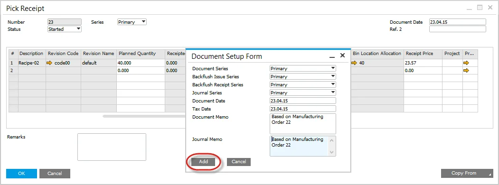
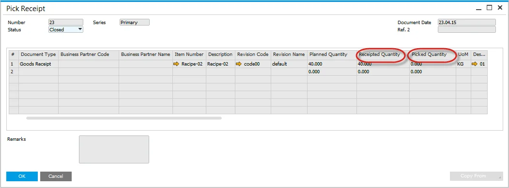
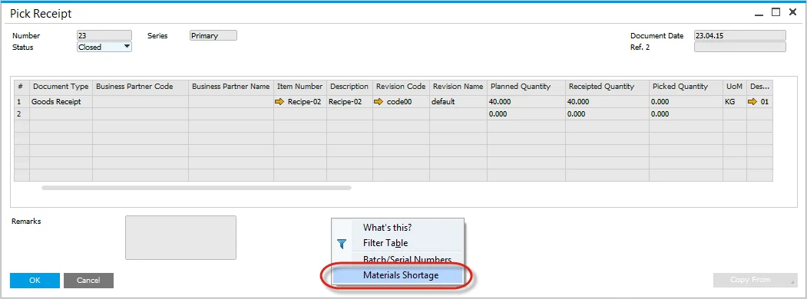
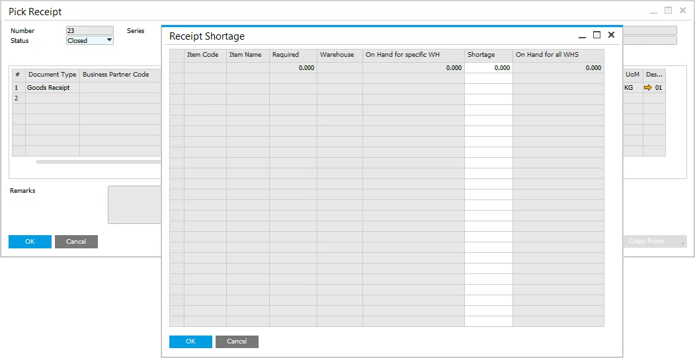

# Pick Receipt Bin Locations and Allocations

On this page, you can check how to manage location allocation on Pick Receipt documents.

---

## Pick Receipt

Efficiently managing bin locations and allocations within a warehouse is crucial for optimizing inventory flow and reducing errors in stock management. The Pick Receipt process ensures that received goods from production are correctly assigned to bin locations. This guide walks you through the steps to allocate bin locations, split quantities across multiple bins, and manage production goods receipts effectively.

### Receipt from Production Process

The Pick Receipt process can be accessed from the context menu on the Manufacturing Order form under Issues and Receipts, selecting Receipt from Production.

### Full quantity entered into Bin

Enter the Quantity within the Pick Receipt. The full quantity is automatically added to the Default Bin Location.

Press the "Update" button to save the transaction.

### Split Quantity across several Bins

If the received quantity needs to be distributed across multiple bins, follow these steps:

- Click on the yellow arrow within the Bin Location Allocation field.
- The Pick Receipt Batches - setup form will open.
  
- Click on the yellow arrow within the Bin Location Allocation field again.
- The Bin Location Allocation - Pick Receipt form opens.
- Enter the desired Bin Location and Allocated quantity.
- Press "Update" to confirm the changes.

  

## Production Goods Receipt

To complete the process, the received goods must be recorded as a Production Goods Receipt:

- From the context menu on the Manufacturing Order form, select Production Goods Receipt.
  
- Enter the required details and press the "Add" button.
  
- The recorded quantity moves from Picked Quantity to Receipted Quantity.
  

### Backflush Materials

If there are backflushed materials within the Manufacturing Order, it is essential to check for material shortages before proceeding with the Production Goods Receipt:

- From the context menu, select Materials Shortage.

    

- If shortages exist, they will be displayed in the Receipt Shortage form.

    

---
