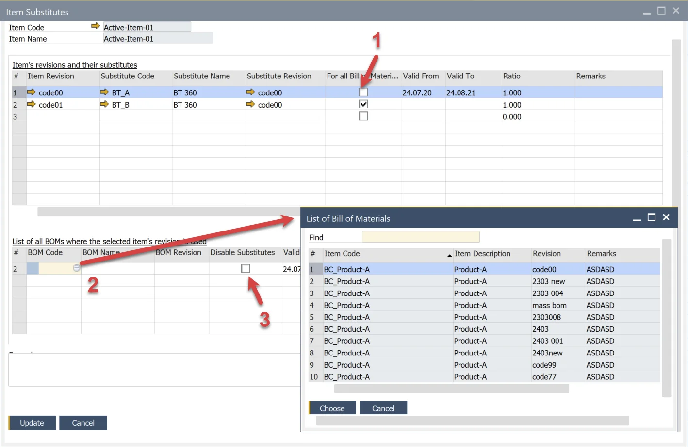
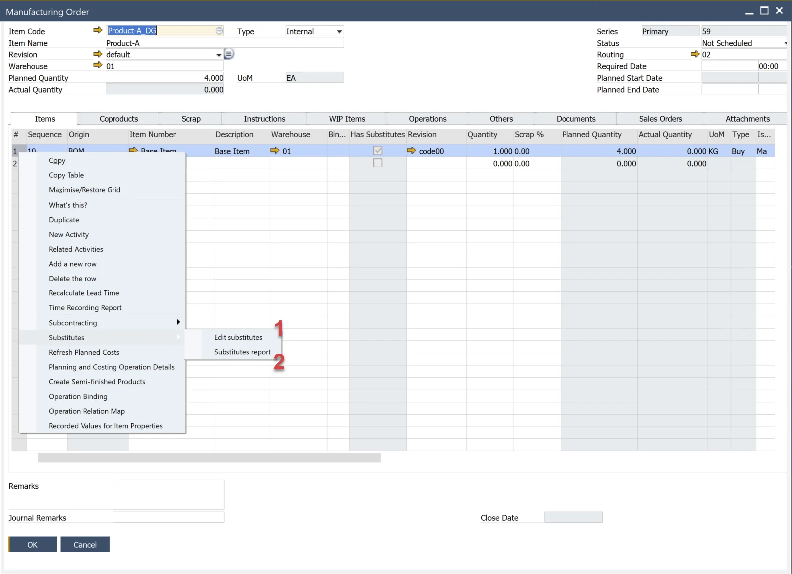

# Item Substitutes

Item Substitute is an important function in inventory and production management. It helps ensure continuity in operations when an item is unavailable by allowing predefined substitutes to be used automatically or manually in documents like Manufacturing Orders and Pick Orders.

This guide walks you through how to configure and use **Item Substitutes** in CompuTec ProcessForce.

---

## Step 1: Open the Substitutes Form

To manage item substitutes:

:::note Path
Main Menu → Inventory → Substitutes
:::

This form contains two main areas:

- **Upper Table**: Configure general substitute rules per item and revision.
- **Lower Table**: Override or exclude substitute rules for specific Bills of Materials (BOMs).

---

## Step 2: Define a Substitute in the Upper Table

In the upper table, you can define substitutes for a specific item revision.

### Fields to Configure

- **Item Revision** - the source item to be substituted
- **Substitute Code** - the replacement item code
- **Substitute Name** - automatically filled
- **Substitute Revision** - revision of the substitute item
- **For all Bill of Materials** - checked by default to apply the substitution across all BOMs
- **Valid From / Valid To** - date range for which substitution is valid
- **Ratio** - quantity ratio (e.g. 1.00 = 100%, 0.5 = 50%)
- **Replace With** - choose if the substitute can replace:
  - Items
  - Coproducts
  - Scrap

  

---

## Step 3: Customize Substitution Per Bill of Materials (Optional)

If you need different rules for a specific BOM:

1. **Uncheck** "For all Bill of Materials".
2. In the lower table, choose the BOM(s) where the item is used.
3. Configure one of the following:
   - **Disable Substitution** - to exclude the substitute for this BOM.
   - **Custom Parameters** - define specific ratio, validity, or replacement rules for this BOM.

---

## Step 4: Access Substitutes from Item Master Data

To open substitutes directly from an item:

1. Go to **Item Master Data**
2. Use the **right-click context menu**
3. Select **Substitutes**

---

## Step 5: Edit Substitutes from Bill of Materials

To modify substitutes within a Bill of Materials:

1. Open a BOM
2. Right-click on the first column of the item row
3. Choose **Edit Substitutes**

---

## Step 6: Use Substitutes in Manufacturing Orders

In a **Manufacturing Order**, right-click on a component item to:

- **Edit Substitutes** - same as in BOM
- **View Substitute Report** - lists available substitute items and their quantities

### Substitute Report

Use this to check substitute stock and availability.

:::info
The following substitutes are **not shown** in the report:

- Substitutes with zero stock in the relevant warehouse
- Substitutes with expired or future validity dates
- Substitutes not defined for the warehouse
- Substitutes excluded from the BOM used for this Manufacturing Order

:::

---

## Step 7: Replace an Item in a Pick Order

You can apply item substitutes in **Pick Orders**:

1. In a Pick Order, locate the unavailable item
2. Use **Choose From List** to select a valid substitute

---

## Summary

Substitutes allow operations to continue smoothly in the event of item unavailability. Configure global or BOM-specific substitutes, access them easily from various master forms, and apply them during production or picking workflows to maintain continuity and flexibility.

---
