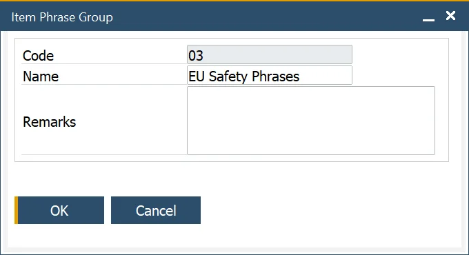

# Phrases

In inventory and compliance management, Item Phrases play a crucial role in conveying important safety, risk, and handling information. These phrases are often based on regulatory guidelines, such as EU Risk and Safety Phrases, and help ensure proper storage, transportation, and hazard communication. Additionally, the ProcessForce Item Phrases feature supports the creation of Material Safety Data Sheets (MSDS) for specific items, making it an essential tool for industries dealing with regulated materials.

---

## Item Phrases

To access Item Phrases, navigate to:

:::note Path
    Administration → Setup → Item Details → Item Phrases
:::

The Item Phrase form allows users to define standard phrases that can be applied to items. Users can also determine which documents a phrase should appear on by selecting the corresponding checkbox.

## Item Phrase Groups

To access Item Phrase Groups, navigate to:

:::note Path
    Administration → Setup → Item Details → Item Phrase Group
:::

To simplify phrase management, users can organize standard phrases into Item Phrase Groups, such as EU Risk and Safety Phrases. Grouping phrases ensures consistency and facilitates compliance with industry regulations.

## Item Phrase Group Assigning

:::note Path
    Administration → Setup → Item Details → Item Phrases
:::

Users can link an Item Phrase Group to an Item Phrase by selecting the Group field and clicking the Choose From List icon.

This helps in maintaining standardized phrasing across multiple items.

## Item Phrase Assigning

To access Phrases tab, navigate to:

:::note Path
    Inventory → Item Details → Phrases tab
:::

Once phrases are created, they can be assigned to specific items under the Phrases tab in the Item Details form.

**Steps to Assign a Phrase**:

1. Navigate to the second column.
2. Click the Choose From List icon.
3. Select the required phrase.

A selected phrase can also be assigned to a specific document type by checking the corresponding checkbox in the relevant column.

---
