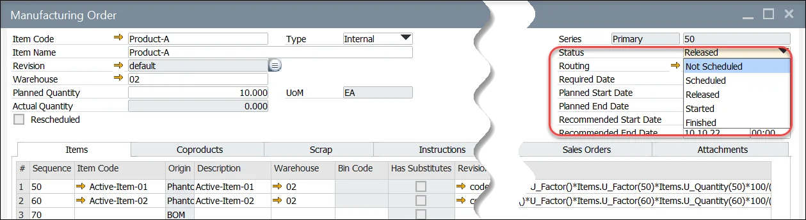

# Manufacturing Order Statuses

Every Manufacturing Order (MO) must have a designated status, which defines the actions that can be performed at each stage of production. The status is assigned in the Manufacturing Order header and plays a crucial role in managing production workflows.

    

---

## Available statuses

- **Not Scheduled**: the manufacturing Order does not have a defined due date.
- **Scheduled**: a due date is set, but materials cannot yet be issued or received from production.
- **Released**: dates are determined for Manufacturing Order; it is possible to issue to / receipt from production
- **Started**: Manufacturing Order changes automatically to this status on any related issue to production or operation start. It is possible to adjust this status manually. Manufacturing Orders with this status should not be re-scheduled
- **Finished**: blocks Manufacturing Order, but the status can still be changed if necessary.
- **Closed**: details of the Manufacturing Order with this status cannot be changed anymore. Optionally changing to this status can also make journal entries based on Manufacturing Order variance (when option [Post variance on Manufacturing Order closure](../../system-initialization/general-settings/costing-tab.md) is set in General Settings).

:::info
You can check possible status changes [here](mass-status-change.md).
:::

You can also use a [mass Manufacturing Order status change tool](mass-status-change.md) to change the status of multiple Manufacturing Orders at once.

## Manufacturing Order Status Change through CompuTec PDC

When an operation is started in [CompuTec PDC](/docs/pdc/), the Manufacturing Order status is automatically updated to Started on the Resource Planning Board and Scheduling if it was previously in Released status.

---
