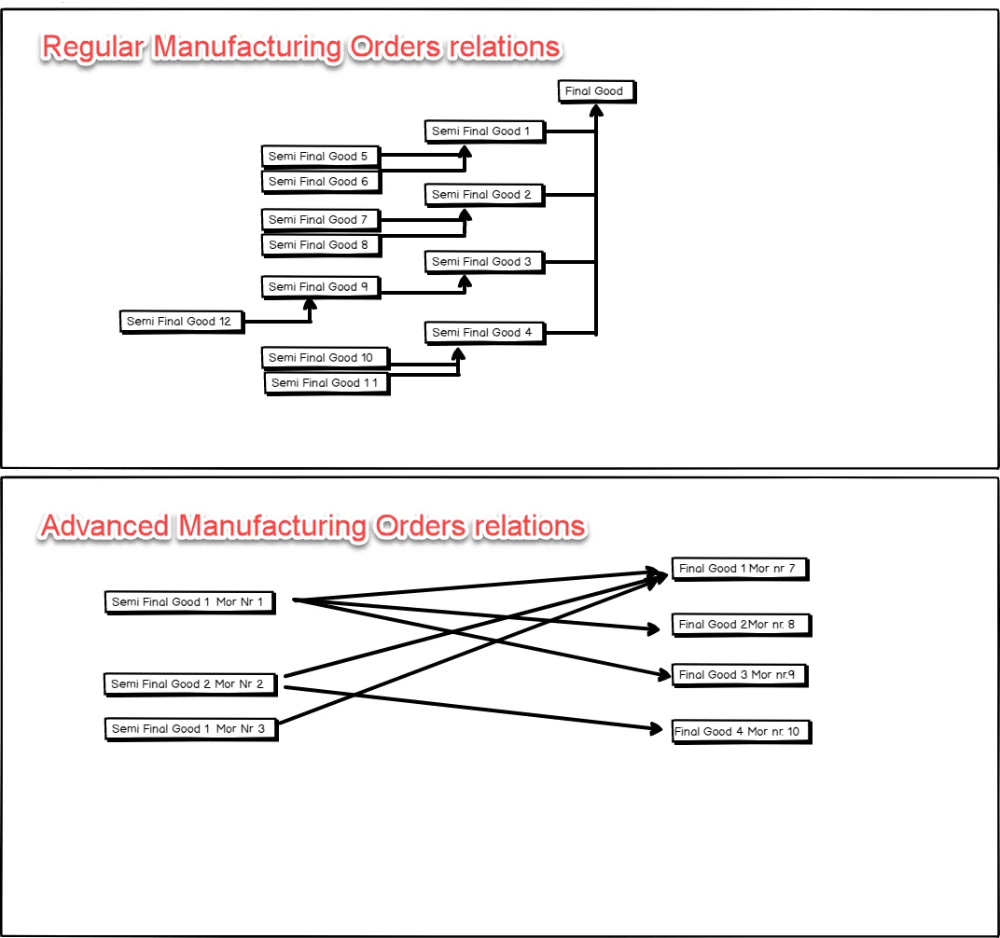
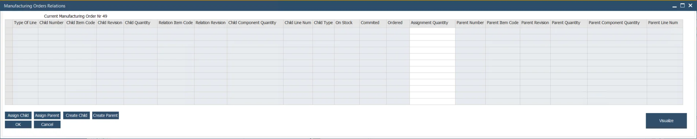

# Manufacturing Orders Relations

In a complex manufacturing environment, managing relationships between different Manufacturing Orders (MOs) is crucial for efficiency and traceability. The Manufacturing Orders Relations feature enables users to create advanced MO connections, linking a Child Manufacturing Order with multiple Parent Manufacturing Orders to streamline production workflows.

---

## Purpose

This functionality provides a structured way to track and manage dependencies between MOs, ensuring smooth production planning and resource allocation.

    

## Activating the Option

:::info Path
Production → Manufacturing Order → Manufacturing Order → Others tab
:::

Click the highlighted button to open the Manufacturing Orders Relations form.

## Manufacturing Orders Relations Form

### Creating relation

#### Assigning Already Existing Manufacturing Orders

##### Assigning Child Manufacturing Orders

Clicking the "Assign Child" button displays a list of all MOs in Scheduled, Released, or Started status for an Item and Revision of a component in the selected MO. Users can choose one or more from the list and click Select to add them as child MOs.

##### Assigning Parent Manufacturing Orders

Clicking the "Assign Parent" button ahows a list of all Manufacturing Orders in Scheduled, Released, and Started status with a component of the chosen Manufacturing Order.

#### Creating new Manufacturing Orders

- **Creating new Child Manufacturing Order**

    Clicking Create Child opens a list of Bill of Materials (BOMs) matching the raw material of the chosen Manufacturing Order, allowing users to generate a new child order.

- **Creating New Parent Manufacturing Orders**

    Clicking the "Create Parent" button leads to a list of all Bill of Materials that have a component of the chosen Manufacturing Order.

#### Visualize

The Visualize option provides a clear scheme of MO connections, helping users understand dependencies and improve production planning.

---
