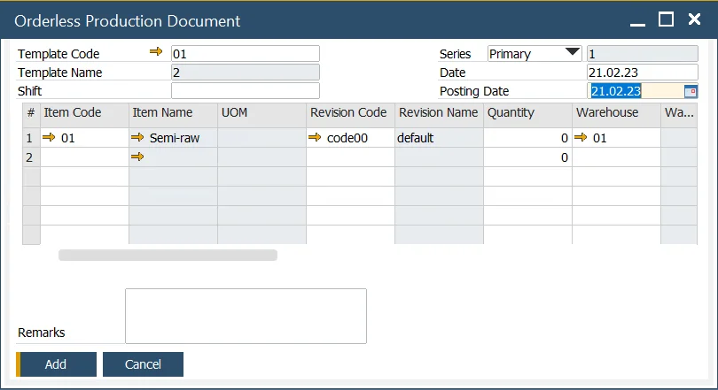

# Orderless Production

Orderless Production is a streamlined manufacturing process that eliminates the need for traditional production orders. This method simplifies and accelerates production by allowing users to record manufacturing activities in a single document while ensuring accurate material and resource tracking. This guide provides an overview of the configuration, usage, and benefits of the Orderless Production function.

---

## Configuration

### Master Data

To use Orderless Production, define the document series for the Orderless Production Document.:

For detailed instructions on setting up a document series, check [here](../system-initialization/document-numbering.md).

### Bill of Material

All items and resources within the Bill of Material and Production Process must be set as "Backflushed" to ensure smooth orderless production.

### Orderless Production Template

To simplify data entry, users can create an Orderless Production Template listing all items to be produced. When selected in the Orderless Production Document, the template automatically populates the form with relevant data, including associated CoProducts and Scrap.

## Orderless Production Document

The Orderless Production Document serves as the central point for recording production activities. Users can select a predefined template or manually enter items to be produced. When an item has associated CoProducts and Scrap, these are automatically included.

The user inputs the posting date and the quantity produced, then confirms the entry. This action triggers a manufacturing order in the background, executing a complete production cycle from release to closure. The following transactions are performed:

|                           |       Items        | Batch Traced Items (set to backflush) Based on FIFO, FEFO & FMFO rules | Non-Inventory Items (set to backflush) | CoProducts (set to backflush) | Scrap (set to backflush) |   Resource Time    | Finished Products  |
| :-----------------------: | :----------------: | :--------------------------------------------------------------------: | :------------------------------------: | :---------------------------: | :----------------------: | :----------------: | :----------------: |
|         Backflush         |                    |                           :heavy_check_mark:                           |           :heavy_check_mark:           |      :heavy_check_mark:       |    :heavy_check_mark:    | :heavy_check_mark: |                    |
|    Create Batch Number    |                    |                                                                        |                                        |      :heavy_check_mark:       |    :heavy_check_mark:    |                    | :heavy_check_mark: |
|      Create Journals      | :heavy_check_mark: |                           :heavy_check_mark:                           |           :heavy_check_mark:           |      :heavy_check_mark:       |    :heavy_check_mark:    | :heavy_check_mark: | :heavy_check_mark: |
| Create Scrap & ByProducts |                    |                                                                        |                                        |                               |    :heavy_check_mark:    |                    |                    |
|     Create CoProducts     |                    |                                                                        |                                        |      :heavy_check_mark:       |                          |                    |                    |
| Create Finished Products  |                    |                                                                        |                                        |                               |                          |                    | :heavy_check_mark: |

---
