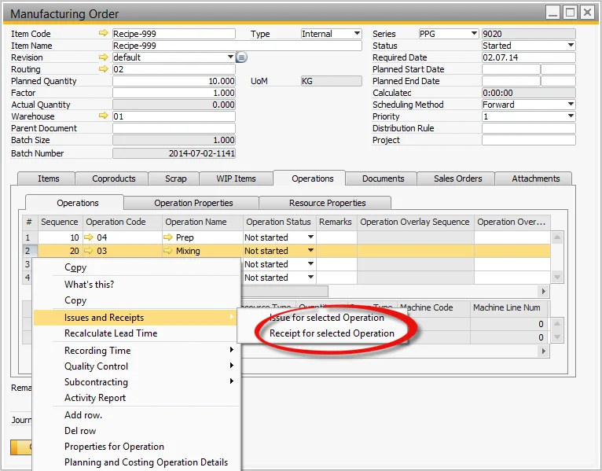

# Receipt from Operation Alternative Processes

When managing manufacturing orders, accurate and efficient processing of receipts is crucial for smooth operations. The "Receipt from Operation Alternative Processes" feature in the Manufacturing Order form allows for flexible and streamlined receipt management. This guide explains the various ways to handle receipts, whether directly from the Operations Tab or by copying from the Pick Receipt process.

---

## Receipt form Operation from the Operations Tab (on Manufacturing Order form)

To initiate a receipt from the Operation directly, follow these steps:

- Select the Operations Tab.
- Select the Operation.
- Select Receipt for selected Operation.

This method ensures that you can easily record the receipt directly linked to the operation being processed.

## Copying Receipt to Operation from the Pick Receipt Process

Another efficient way to handle receipts is by copying them from the Pick Receipt process. To do this:

- Select the Pick Receipt from within the Manufacturing Order from the Menu.
- Select Copy From.
- Select Manufacturing Order Operations.
- Perform the Pick Receipt process as normal.

This approach allows you to copy receipt information across different operations, ensuring consistency and minimizing manual data entry.

---
