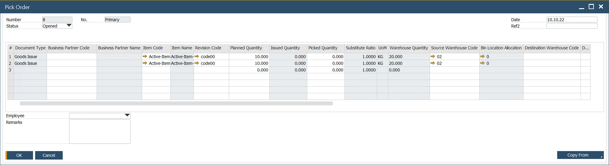

# Pick Order

Efficient inventory management is critical for smooth manufacturing operations, and the Pick Order function in CompuTec ProcessForce plays a key role in ensuring the right materials are available at the right time. This feature facilitates the picking process by offering both automatic and manual creation options, improving efficiency and accuracy in inventory handling.

---

## Key Features

The Pick Order function provides several options for managing inventory picking:

- **Automatic Creation**: a Pick Order is automatically generated from a Manufacturing Order, carrying over item details.
- **Manual Creation**: users can manually create a Pick Order and copy single or multiple Manufacturing Orders into it.
- **Existing Pick Orders**: a single Pick Order can be linked to multiple Manufacturing Orders, consolidating requirements for efficient handling.

When a Pick Order is created from a Manufacturing Order, the Items, Planned Quantity, and Source Warehouse are copied over. If any Distribution Rules, Cost Dimensions, or Project assignments exist at the item level, they are also transferred. If these fields are left blank, they can be manually updated.

    

## Employee Field

An Employee filed is available for assigning an employee to a specific Pick Order.

## Manual Creation of Pick Orders

Pick Orders can be created manually when needed. The Copy From function allows users to select one or more Manufacturing Orders to consolidate picking tasks.

Additionally, if a Pick Order has already been created for a Manufacturing Order, users can further refine it by adding multiple Manufacturing Orders, effectively generating a consolidated Pick List.

**Important Note**:

If multiple Manufacturing Orders require the same item, the Pick Order will display a separate row for each requirement, ensuring accurate tracking of materials.

To complete the Pick Order to Production Goods Issue cycle, refer to: Pick Order Bin Locations and Allocations.

---
