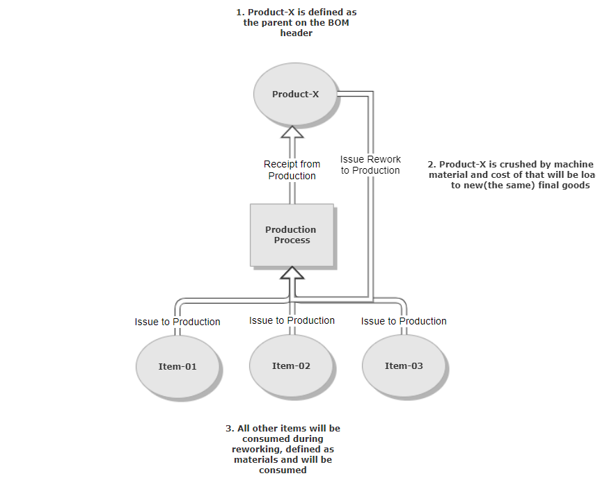
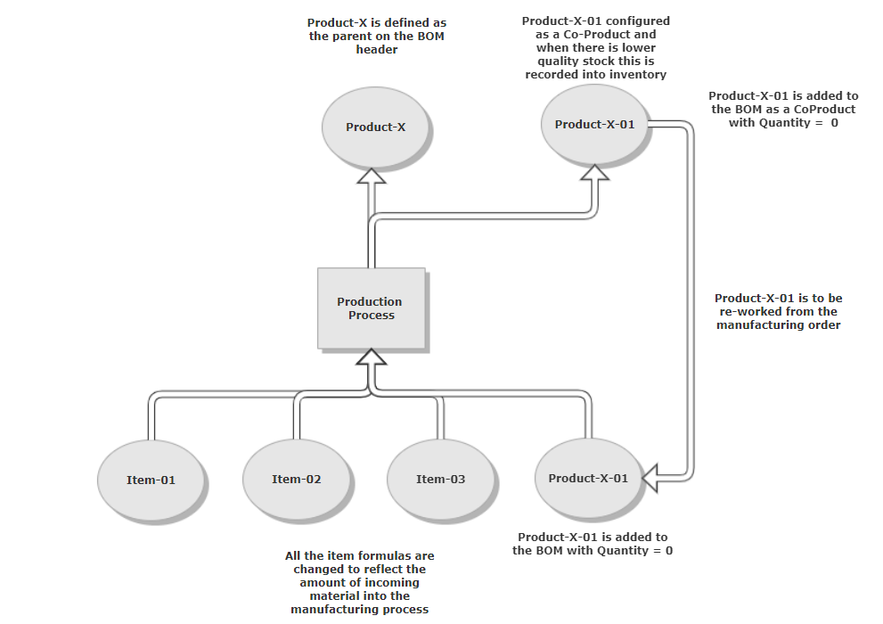

# Rework

Rework is an essential part of manufacturing that ensures product quality and minimizes waste. ProcessForce offers multiple ways to handle rework, depending on the type of issue, the stage in production, and the required documentation. Choosing the right method helps maintain efficiency while ensuring traceability and compliance. Below are three key methods for managing rework in ProcessForce:

## Rollback

The Rollback method creates a reverse document for the selected transaction, making it a simple and effective solution when rework needs to be done within the same Manufacturing Order.

To perform a rollback:

1. Navigate to the Documents tab.
2. Select the document line you want to reverse.
3. Right-click and choose 'Issue and Receipts' → 'Rollback Document.'

## Issue Rework to Production

This method allows you to create a Goods Issue document using the same ItemCode as the finished product. It is typically used when the finished product needs to be reintroduced into the production process—either for repacking or mixing with fresh raw materials.

To issue rework to production:

1. Open the Manufacturing Order screen.
2. Right-click an empty area and select 'Issue and Receipts' → 'Issue Rework to Production.'
3. ProcessForce will generate a Pick Order with the Finished Good ItemCode—update the quantity and batch numbers as needed.

    

## Bill of Materials Revision with special ItemCode

If rework is a known requirement, you can configure the Bill of Materials (BOM) accordingly. This method involves defining a special ItemCode (different from the Finished Good Item) as both a Coproduct and Raw Material within the BOM.

Using this approach provides better visibility into warehouse stock, distinguishing between finished goods ready for shipment and products requiring rework.

An example of this method is shown below:

    

---
