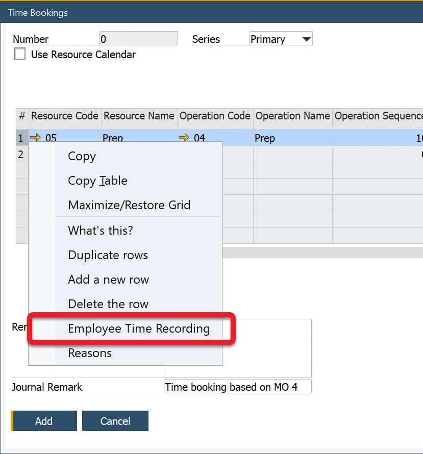
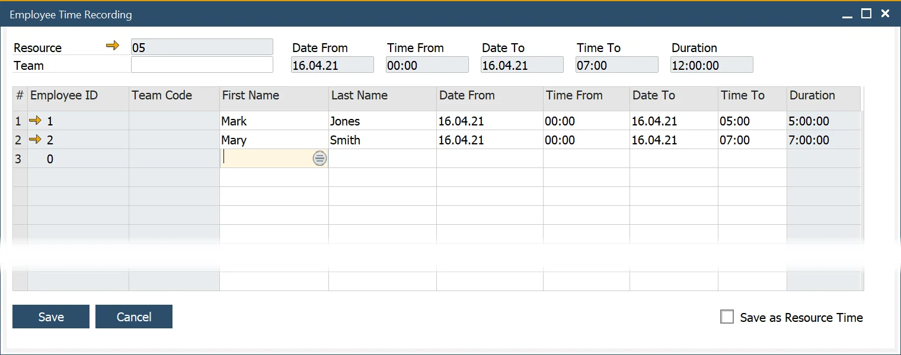

# Employee Time Recording

Accurately tracking employee work hours is essential for effective project management and cost allocation. The Employee Time Recording feature allows users to log additional Employee Time against a specific Task in a [Time Booking document](time-bookings.md):

:::note
    Employee Time can only be added if the related Time Booking document has not yet been posted. Once a Time Booking is added, Employee Time entries become read-only. However, if modifications are needed after posting, a [Time Corrections document](time-corrections.md) can be created to incorporate Employee Time adjustments.
:::

---

## Steps to Record Employee Time

- Choose the relevant row in the Time Booking document.
- Open the context menu and select ‘Employee Time Recording’.

    

- Select an employee from the list using the First Name or Last Name field.
- Alternatively, assign an entire team by selecting a Team from the dropdown.

    

- Set the required values in the dates and times columns.
- The Duration column automatically calculates the total time worked.
The total duration will be added from all the rows and displayed in the Duration field in the header.

**Important Note**:

While Employee Time is recorded for reference, its cost is already included in the Resource Cost. This means that Employee Time tracking primarily serves informational purposes, such as logging extra employees who assisted in a task.

If the recorded Employee Time should contribute to Resource Time, enable the ‘Save as Resource Time’ checkbox. This action adds the header Duration value to the UE Duration field in the corresponding Time Bookings document.

---
