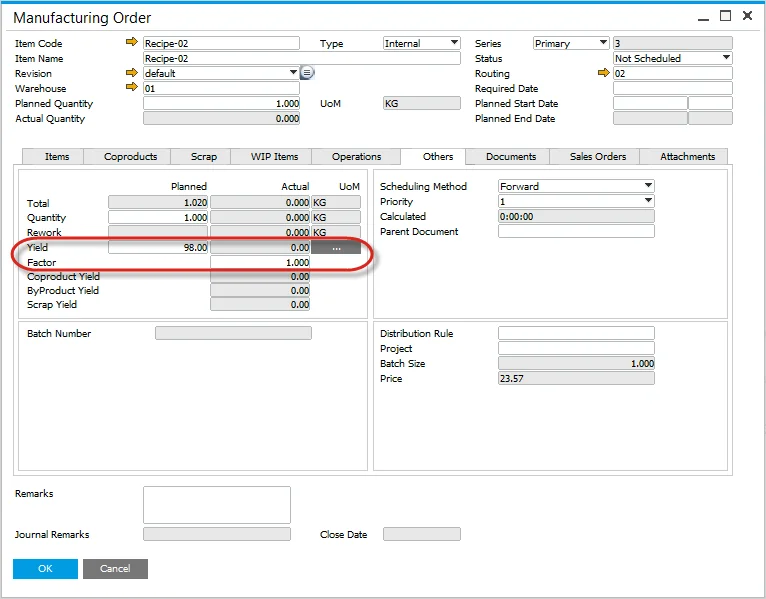

# Yield Based Production

Yield-Based Production ensures accurate planning and analysis of material usage and production output. By tracking planned and actual yields, manufacturers can optimize efficiency, reduce waste, and enhance overall productivity.

For more details on yield planning, click [here](../../user-guide/formulations-and-bill-of-materials/bill-of-materials/bom-planned-yield.md) and for yield analysis, click [here](../../user-guide/formulations-and-bill-of-materials/bill-of-materials/yield-analysis.md).

    
