# Automatic Creation of Quality Control Documents

Efficient **Quality Control** (**QC**) processes are essential for maintaining product standards and ensuring compliance. To simplify this, you can automate the creation of QC documents based on predefined conditions.

This feature supports two approaches:

- **Option 1**: With frequency control based on **Supplier Rating** (using **Counter Schemes**) for **Goods Receipt PO** (**GRPO**) only.

- **Option 2**: Without frequency control (QC created for every qualifying transaction)  

## Prerequisites

To enable automatic QC document creation, follow these steps:

1. Log in to **SAP Business One**.
2. Go to: **Administration** > **System Initialization** > **General Settings**.

        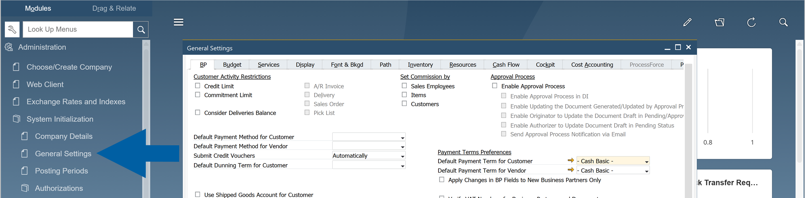

3. Navigate to **ProcessForce** tab > **QC** tab.

       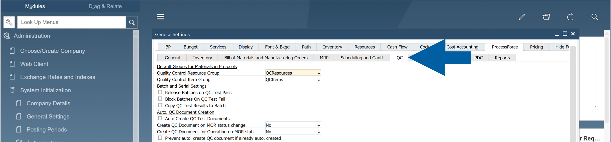

4. Select the option for automatic QC test document creation to enable it.

        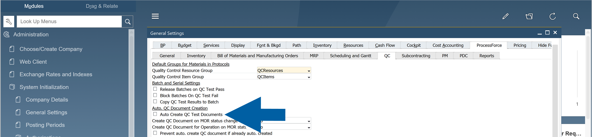

5. Click **Update** to save the changes.

## Configuration Options

Choose one of the following configuration options depending on your business requirements.

### Option 1: Enable automatic creation of Quality Control documents with Frequency Control

Use this option when QC documents should be created at defined intervals (for example, every 30 batches), typically based on supplier performance.

To enable automatic creation of **Quality Control** documents with **Frequency Control**, follow these steps:

#### Step 1: Create a Counter Scheme

1. Go to: **Administration** > **Setup** > **Quality Control** > **Counter Schemes**.

        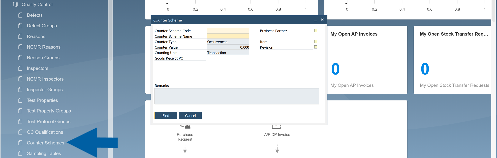

2. Define a **Counter Scheme**, for example, create a scheme that generates a QC document every 30 batches.

        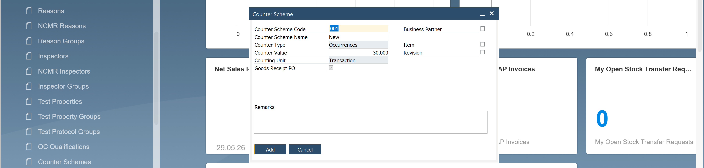

3. Click **Add** to save the changes.

#### Step 2: Assign Counter Scheme to Test Protocol

1. In **SAP Business One** menu, go to **Quality Control** > **Test Protocol**.

       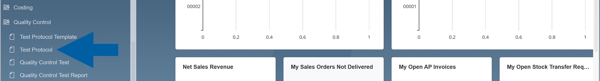

2. Click the **Counter Scheme Code** field to select the **Counter Scheme**.

        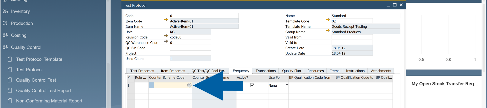

3. Select your counter scheme code and click **Choose**.

        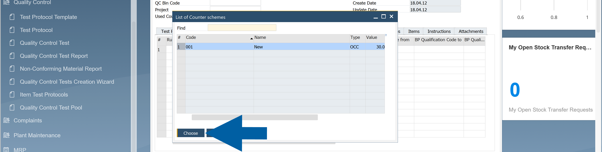

4. Check the **Active** field to activate it.

        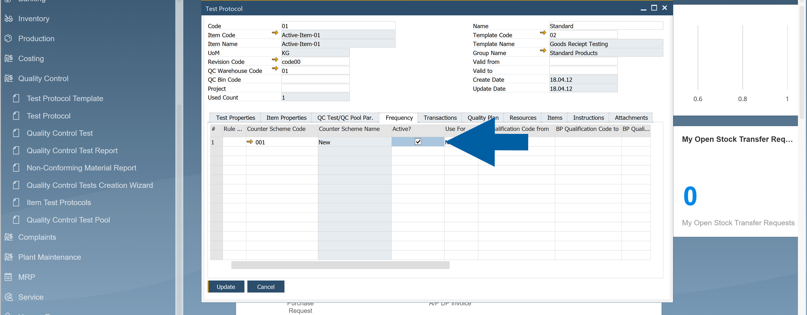

5. Click **Update** to save your changes.

#### Step 3: Configure QC Test Creation

1. Navigate to the **QC Test/QC Pool Pr.** tab.

        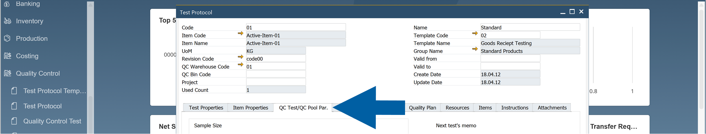

2. Check the **Auto Create QC Test / QC Test Pool** and **Use the Frequency Rules** options to automatically create tests based on the defined frequency.

        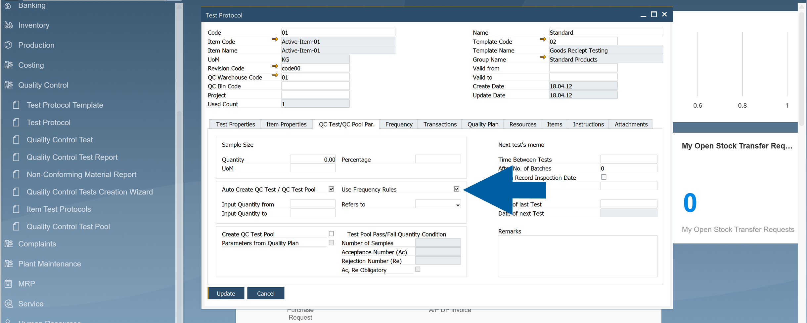

3. In **Transactions** tab, specify the transaction types that trigger QC documents.

        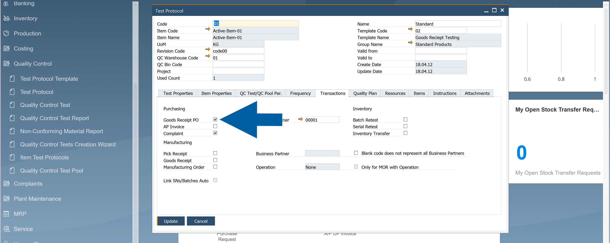

4. Save the changes.

        :::info[Important]

        This functionality currently supports only one transaction type: **Goods Receipt PO**.

        The **Counter Typ**e must be set to **Occurrences**.

        The feature works only when:  
        ``Enable Create Closed QC Tests from Frequency Rules`` = ``Yes``  
        in **Administration** > **System Initialization** > **General Settings** > **ProcessForce** > **QC**.
        :::

### Option 2: Without Frequency Control

Use this option when QC documents should be created for every qualifying transaction, without applying frequency rules.

This option is available for all transaction types supported in the **Test Protocol** settings.

To set up automatic creation of **Quality Control** documents without **Frequency Control**, follow these steps:

1. In **SAP Business One**, go to **Quality Control** > **Test Protocol**.

        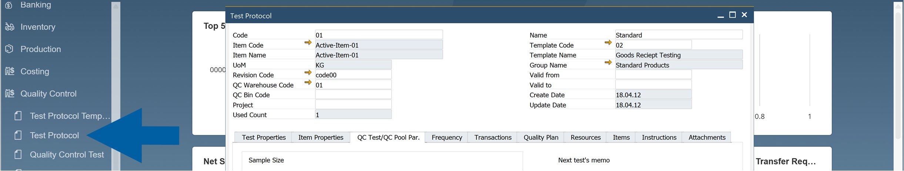

2. Navigate to **QC Test / QC Pool Pr.** tab.  

        

3. Turn on the **Auto Create QC Test / QC Test Pool** function.

        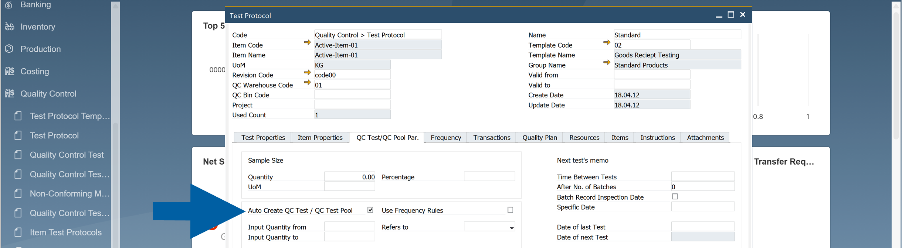

4. In **Transactions** tab, specify the transaction types that trigger QC documents.

        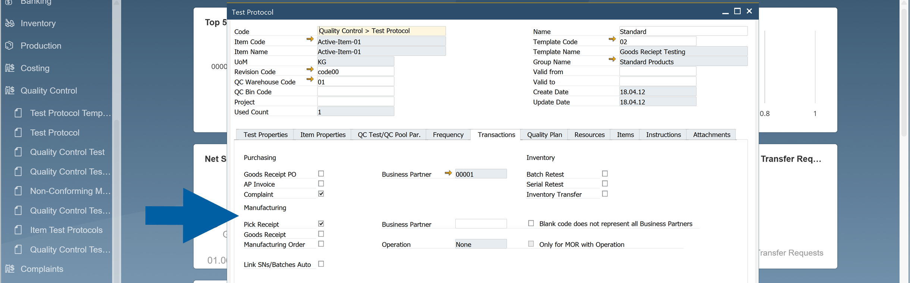

5. Save the changes.

### Business Partner Configuration (Applies to Option 1)

#### Step 1: Create Qualifications

To tailor QC processes for specific suppliers, you have to create **Qualifications**. Here’s how to do it:

1. In **SAP Business One**, go to: **Administration** > **Setup** > **Quality Control**.

2. Navigate to **QC Qualifications**.

        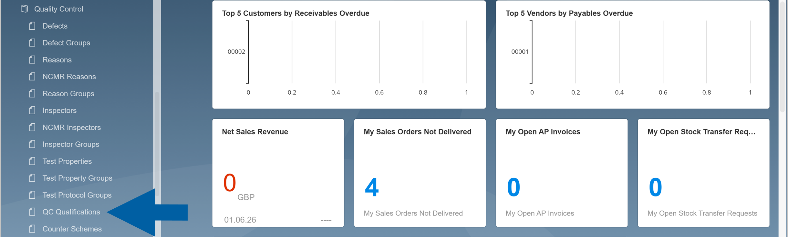

3. Create new qualifications.

        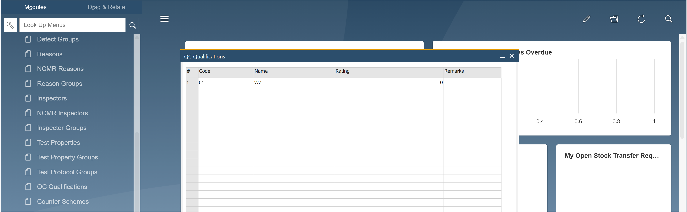

4. Click **Update** to save the changes, and then **OK** to close the window.

5. Go to **Business Partners** > **Business Partner Master Data**.

        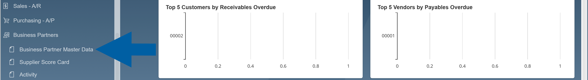

6. Choose or add a **Business Partner**.

7. In **General** tab, click on the **QC qualification** field.

        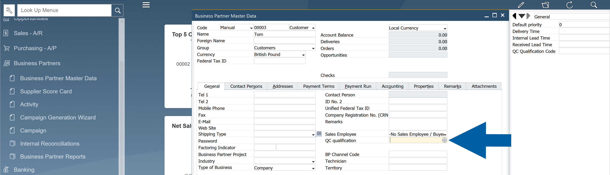

8. Select the defined qualifications from the list and click **Choose** to assign it to the business partner.

        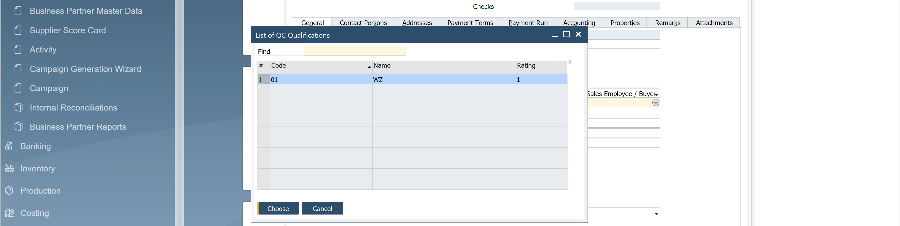

9. Click **Update**.

        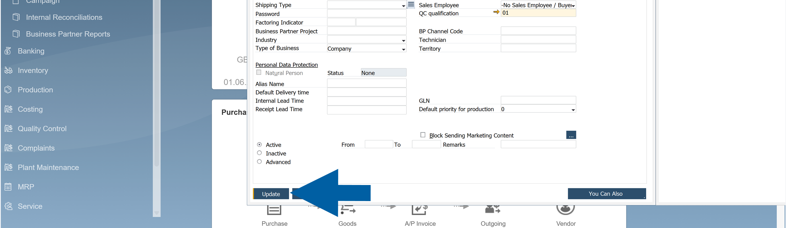

#### Step 2: Connect Qualifications to Test Protocols

Now you have to connect the relevant qualifications to the appropriate **Test Protocols**.

1. In **SAP Business One**, go to **Quality Control** > **Test Protocols**.

2. Navigate to **Frequency** tab.

        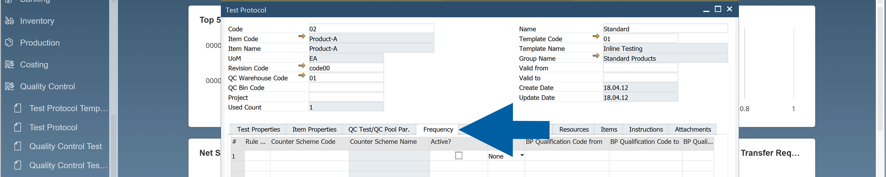

3. Enter the code of your qualifications in **BP Qualification Code from** and **BP Qualification Code to** fields.

        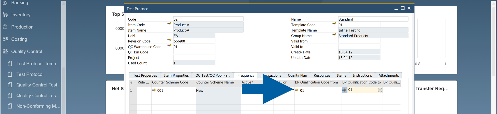

4. Click **Update**.
5. Done! The assigned qualification will be used when applying frequency-based QC rules during **Goods Receipt PO** processing.
