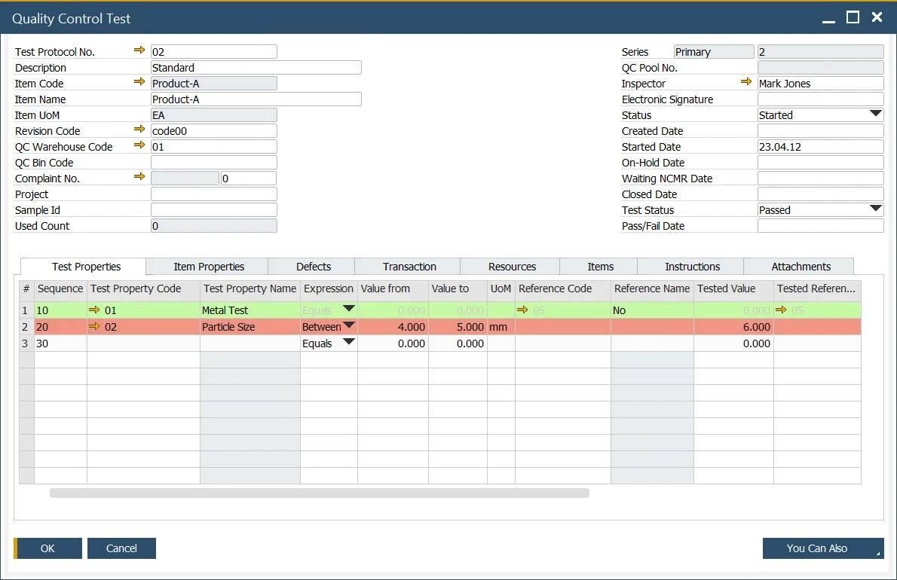

# Overview

## The 4 W's of Quality Control

The Quality Control function within ProcessForce is designed to ensure thorough testing and inspection by covering the 4 Ws of Quality Control:

- **What**: identifies the test and item properties to be evaluated.
- **When**: specifies the frequency of the testing process.
- **Where**: defines the transactions during which the test will be performed.
- **With**: details the resources and items that are used within the testing process.

**Quality Control can be used to manage the following processes**:

- **In-bound**: Goods Receipt,
- **In-process**: Manufacturing Order and its associated operation,
- **Inventory**: Inspection, and re-testing.

:::info Path
    Main Menu → Quality Control
:::

---
