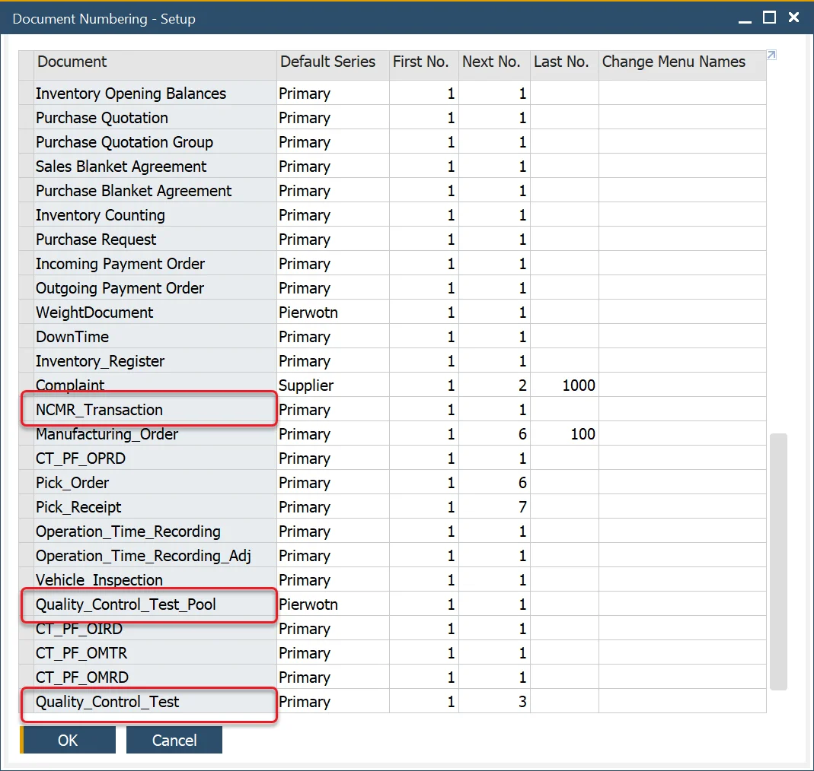
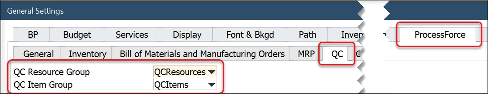
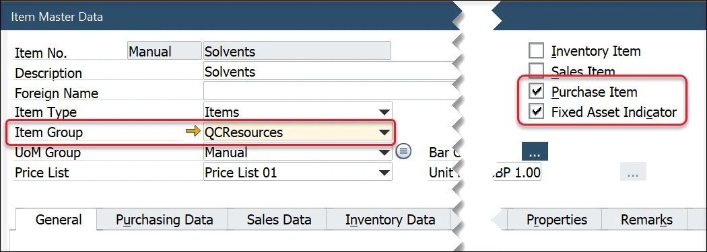
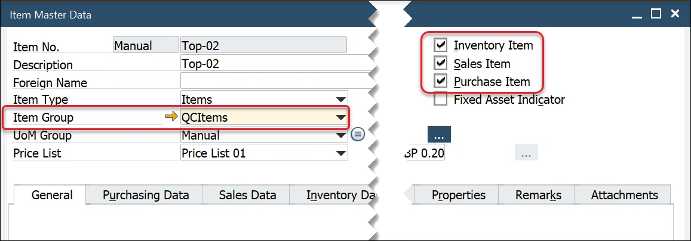

# Quality Control Configuration

The Quality Control Configuration section allows users to define the essential settings for conducting quality tests. This includes configuring Document Series Numbers, defining resources, and managing item information for the testing process. Proper configuration ensures seamless and accurate quality control processes across various testing activities.

---

## General Settings

Click [here](../../user-guide/system-initialization/general-settings/qc-tab.md) to find out more on Quality Control.

## Document Series Number

The [Quality Control Test](./quality-control-test/overview.md) form and [NCMR Transaction](./ncmr-non-conforming-materials-report.md) and [Quality Control Pool](./test-protocols/quality-control-tests-pool.md) forms use the SAP Business One Document Numbering functions.

## Resources

Within the Test Protocol and Quality Control Test forms, users can define the resources used to conduct and complete the testing activity such as X-ray machines, microscopes, tooling, etc.

These forms filter the Item Master Data based on the following criteria:

- The Purchase Item and Fixed Assets fields are checked.
- A specific Item Group is created.
- Select the Item Group within the QC Resource Group in the ProcessForce tab in General Settings.

## Items

The Test Protocol and Quality Control Test forms also allow users to define specific items related to quality control, such as safety glasses, gloves, or chemicals used only within the Quality Control process and department. These forms filter the Item Master Data based on the following criteria:

- The Inventory, Sales, and Purchase Item fields are checked.
- A specific Item Group is created.
- Select the Item Group within the QC Item Group in the ProcessForce tab in General Settings.

---
