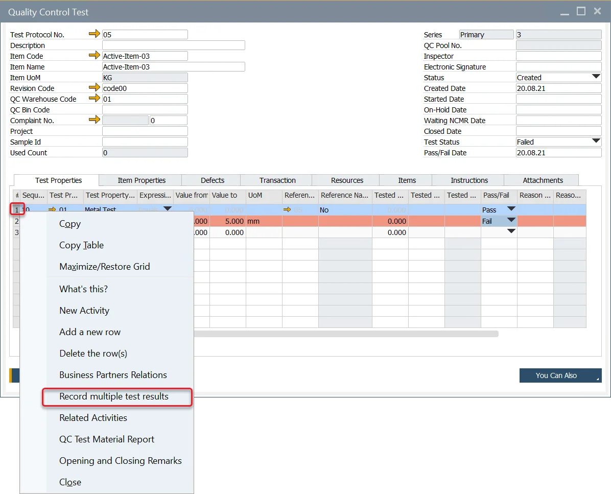
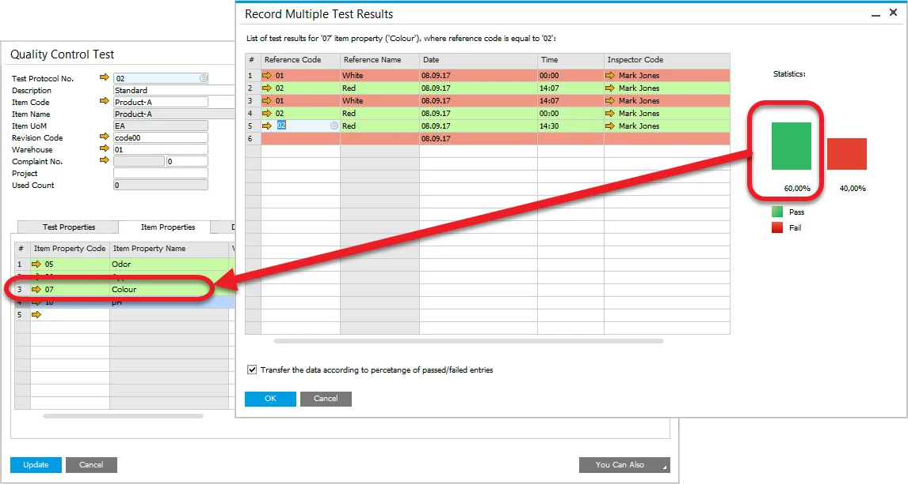
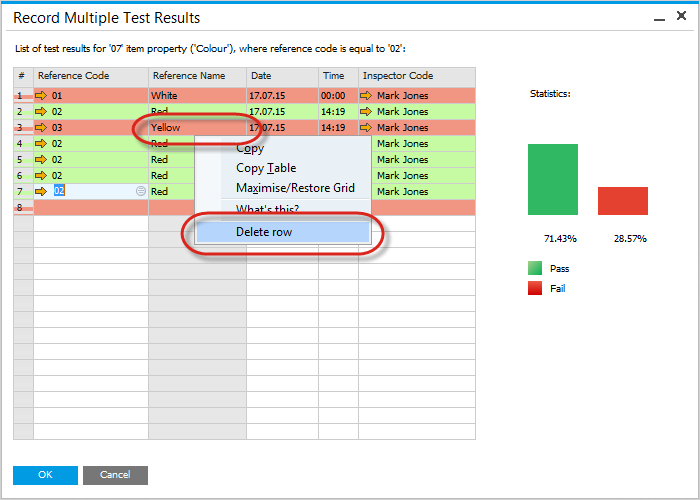

# Multiple Test Result Record

This page provides detailed instructions on how to set up and record multiple test results for a specific Quality Control Test. This feature enables users to group and manage multiple test records associated with the same Item or Test Property, streamlining the process of tracking and analyzing test results.

---

## Setting Up

- Check to [Enable Multiple Test Results](../../system-initialization/general-settings/qc-tab.md) checkbox in Administration → System Initialization → General Settings → ProcessForce tab → QC tab to allow to perform Multiple QC Test Results. Click [here](../../system-initialization/general-settings/qc-tab.md) to check how to do that.
- Ensure that the Quality Control Test form is in confirmation or update mode, indicated by the OK or Update button in the lower left corner of the form.

## The Quality Control Test Form

If the *Enable Multiple Test Results* is checked, users can record multiple test results for a specific Test Property or Item Property within the Quality Control Test form.

To add multiple test results for a Test Property, right-click on the corresponding Test Property row in the QC Test form and select Record Multiple Test Results from the context menu:

Similarly, to add multiple test results for an Item Property, right-click on the respective Item Property row in the QC Test form and choose Record Multiple Test Results.

## Multiple Test Results form

Once the actions described above are completed, the Multiple Test Results form will appear:

### Header

The header label on the form specifies the Test Property or Item Property for which the form has been opened.

### Table

#### Data

The following data can be set:

- the tested value,
- the tested reference code,
- date of the test,
- time of the test,
- the inspector code.

#### Color Marking

Row colors visually represent the entered tested value in relation to the initial and closing range values of the corresponding Quality Control Test row for which the Record Multiple Test Results form was opened. The color scheme matches the row coloring used on the Quality Control Test form.

#### Statistics

The form has also its statistics section, which presents the following:

- the percentage of the passed tests,
- the percentage of the failed tests,
- and the bar chart.

This statistics section is refreshed when:

- a new row is added,
- a row is deleted,
- tested value is changed.

#### Checkboxes

##### Reference Name Property

For properties that involve numeric values (e.g., particle size = 5), a checkbox with the following description is available:

**Transfer the data according to the percentage of passed/failed entries**:

When this option is selected, the system calculates the average value from all the entries recorded on the Record Multiple Test Results form and automatically populates the result into the Property field on the Quality Control Test. This feature is applicable exclusively to properties with numeric values.

##### Numeric Value Property

If the tested property gives a numeric value (e.g., particle size = 5), a check box with the following description is presented:

**Transfer the average value from the above test results**:

Checking it causes loading to the Property field on Quality Control Test, a result that is an average value calculated from the values recorded on the Record Multiple Test Results form. This option is available for properties with numeric values only.

#### Deleting Rows

To delete a row:

- right-click on the row to be deleted
- select Delete row from the context menu

---
