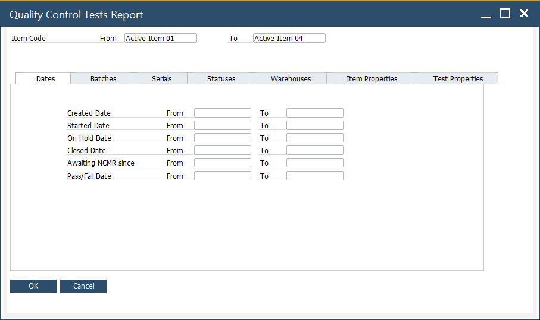
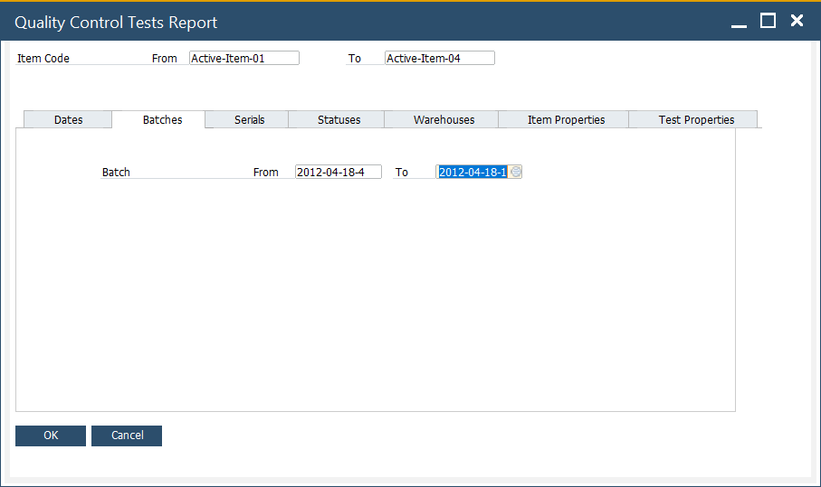
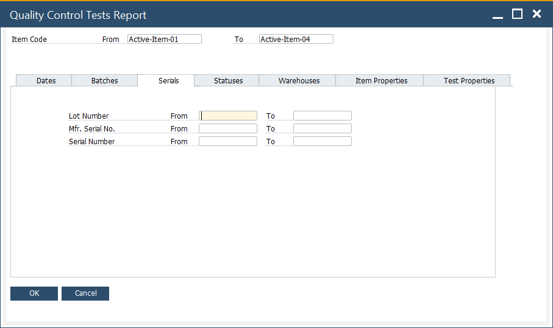
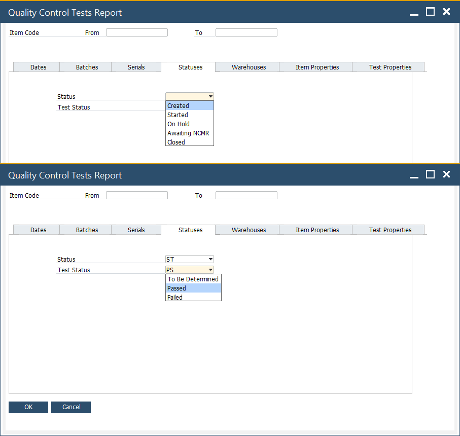
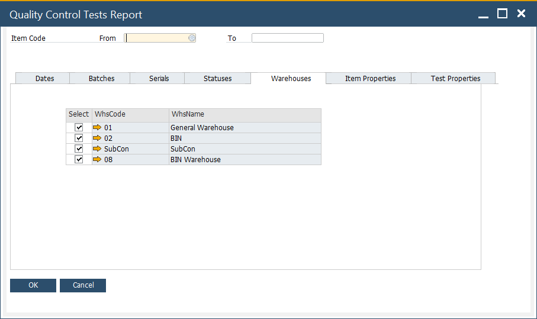
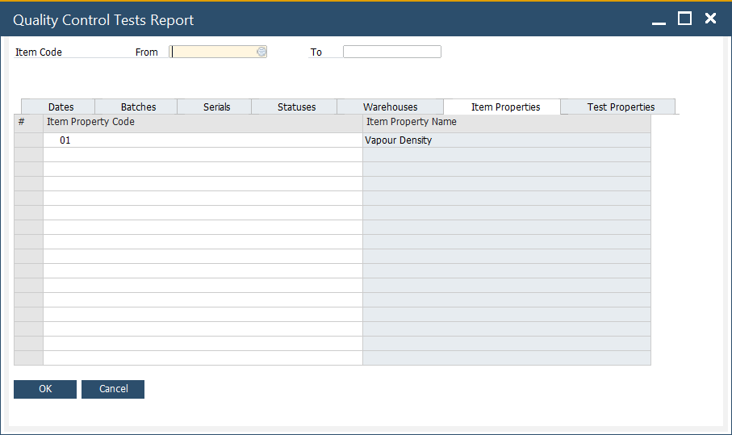
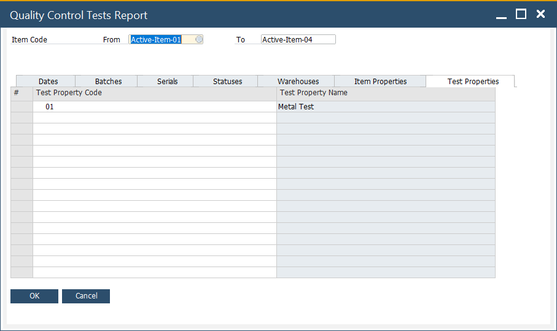

# Quality Control Test Report

The Quality Control (QC) Test Report is designed to help businesses maintain product quality standards by tracking and analyzing test results for items across batches, serials, and warehouses. It ensures that all manufactured or procured items undergo the required quality checks before being released for further use in production or sales.

**Purpose of the Report**

- Provides visibility into the quality status of items across the supply chain.
- Ensures compliance with industry regulations, customer requirements, and internal quality standards.
- Helps identify items that pass, fail, or are pending testing.

---

## Key Functionalities

1. **Item Selection Range**
    Users can select a range of items (From–To) for which quality control results need to be displayed.
    Allows quick filtering of items under active quality monitoring.

2. **Filter Criteria**
    The report can be filtered by multiple parameters to narrow down results:

    **1. Dates**: Define a time range for when QC tests were carried out. It allows users to filter and generate reports based on specific date-related fields. This is crucial for analyzing the timing and progress of quality control testing processes. The tab provides flexibility to track items and their associated tests through various stages using date filters.
            
        - Created Date (From – To): Filters reports based on when the item or batch was created.
        - Started Date (From – To): Filters reports based on the date when testing or production processes began.
        - On Hold Date (From – To): Filters based on when an item or batch was put on hold during testing or production.
        - Closed Date (From – To): Filters reports based on the date when the quality control tests were completed or closed for an item.
        - Awaiting NCNR Since (From – To): Filters reports based on when the item has been awaiting Non-Conformance and Non-Release (NCNR) actions.
        - Pass/Fail Date (From – To): Filters based on when the final test results were recorded, determining whether the item passed or failed the quality control process.

    **2. Batches**: The Batch tab allows users to filter and generate quality control test reports based on batch-related details. Batches are commonly used in industries like manufacturing, pharmaceuticals, food & beverages, and electronics, where products are produced in large quantities and tracked for quality assurance. This tab ensures that quality control tests are tied to specific batches, which is crucial for product traceability and compliance.
        
        - Batch (From – To): Filters the report based on a defined range of batch numbers.
        - Production Date (From – To): Allows filtering by the production date range of the batch.
        - Batch Status (From – To): Filters the report based on the status of the batch (e.g., tested, approved, rejected).

    **3. Serials**: The Serials tab allows users to filter and generate quality control test reports based on serial-related details. Since many industries (like pharmaceuticals, food & beverages, electronics, or life sciences) work with serialized products for compliance and traceability, this tab ensures that QC results can be tracked down to individual serials or lots.
        
        - Lot Number (From – To): Filters reports based on defined lot numbers.
        - Manufacturer Serial No. (From – To): Filters reports using the manufacturer’s assigned serial number range.
        - Serial Number (From – To): Allows filtering by the internal serial numbers maintained in SAP Business One.

    **4. Statuses**: The Statuses tab enables users to filter and generate quality control test reports based on the status-related details of the items. This functionality is particularly important in industries where tracking the progress or status of items through various stages of testing, approval, or production is critical for quality assurance and compliance.

            
        - Created Date (From – To): Filters the report based on when the item was created.
        - Started Date (From – To): Filters reports based on when the quality control tests or production for the item began.
        - On Hold Date (From – To): Filters the report by the date when the item was put on hold during testing or production.
        - Closed Date (From – To): Filters the report based on when the testing or production process for the item was completed and closed.
        - Awaiting NCNR Since (From – To): Filters the report based on when the item has been awaiting Non-Conformance and Non-Release (NCNR) actions.
        - Pass/Fail Date (From – To): Filters the report based on when the final test results (pass or fail) were recorded.

    **5. Warehouses**: The Warehouses tab in the Quality Control Tests Report allows users to filter and analyze quality control results based on specific warehouse locations. Since items can be stored in multiple warehouses, this tab ensures that QC checks are linked to the correct storage site, making tracking and reporting more accurate.

            
        - Select Checkbox: Allows users to include or exclude warehouses when generating the QC report.
        - WhsCode (Warehouse Code): A unique identifier assigned to each warehouse.
        - WhsName (Warehouse Name): The descriptive name of the warehouse.

    **6. Item Properties**: The Item Properties tab provides detailed information about the characteristics or attributes assigned to items that are relevant for quality control. This tab ensures that all quality control checks are aligned with the defined item-specific attributes.

            
        - Item Property Code: A system-generated or user-defined code that uniquely identifies the property linked to the item.
        - Item Property Name: A descriptive label for the property that highlights what characteristic is being tracked.

    **7. Test Properties**: The Test Properties tab provides detailed visibility into the specific quality parameters that are applied to items within the selected range.

            
        - Test Property Code: A unique identifier assigned to each quality test property.
        - Test Property Name: A descriptive name of the quality test associated with the code.

---
