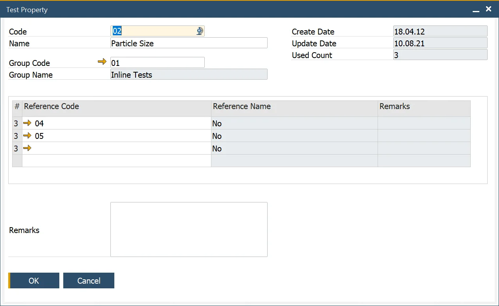
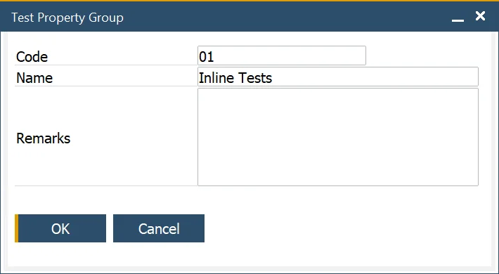

# Test Properties

Test Properties are fundamental to the Quality Control Test process, allowing businesses to define and categorize key attributes that are tested. These properties help in determining and recording testing results, facilitating analysis and reporting. Through this functionality, users can set up properties based on numeric values or reference values, ensuring accuracy and consistency in the quality control process.

:::info Path
    Administration → Setup → Quality Control → Test Properties
:::

This form allows the user to define Test Properties and is used within the Test Protocol Template, [Test Protocol](./test-protocols/overview.md) and [Quality Control Test](./quality-control-test/overview.md) forms to determine and record testing results.

The Used Count field indicates how often the Test Property has been used and is used for reporting and analysis purposes.

## Reference

:::info Path
    Setup → Item Details → Property Reference Library
:::

A Test Property in a Quality Control Test can have either numeric or reference values:

- **Numeric Values**: These are directly defined within the Quality Control Test and are used to record measurable results, such as particle size or the number of items in a sample.
- **Reference Values**: These do not include numeric values but instead represent predefined outcomes, such as color options (e.g., Yellow, Red, or Green). The possible reference results for a specific Test Property can be selected from a table within the Test Property form.

Property can be defined in Property Reference Library. By checking a specific checkbox, you can choose for which Property type this reference is available.

## Test Property Group

:::info Path
    Administration → Setup → Quality Control → Test Property Groups
:::

This form allows the user to define Test Property Groups that are used to group Test Properties into categories for analysis and reporting purposes.

---
