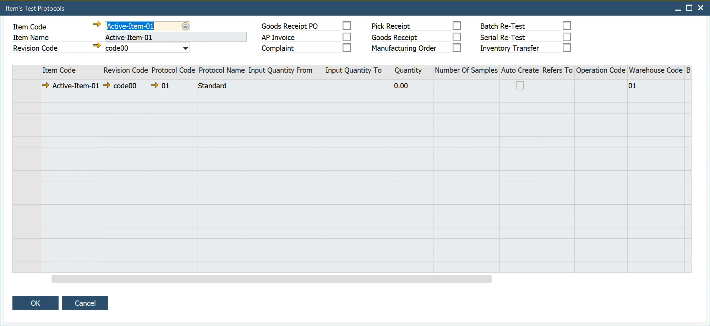

# Item Test Protocols

The Item's Test Protocols form serves as a powerful tool for retrieving all Test Protocols associated with a selected Item or its Revision. This feature ensures streamlined access to relevant testing information for quality control purposes.

:::info Path
    Quality Control → Item's Test Protocols
:::

The form's header provides filtering options for Test Protocols. When an Item Code is selected, the Item Name is auto-populated. The Revision Code defaults to the most recent revision but can be adjusted if needed. To refine the results further, specific transaction checkboxes can be selected. If no checkboxes are checked, the form will display all Test Protocols linked to the chosen Item and its Revision.

---
