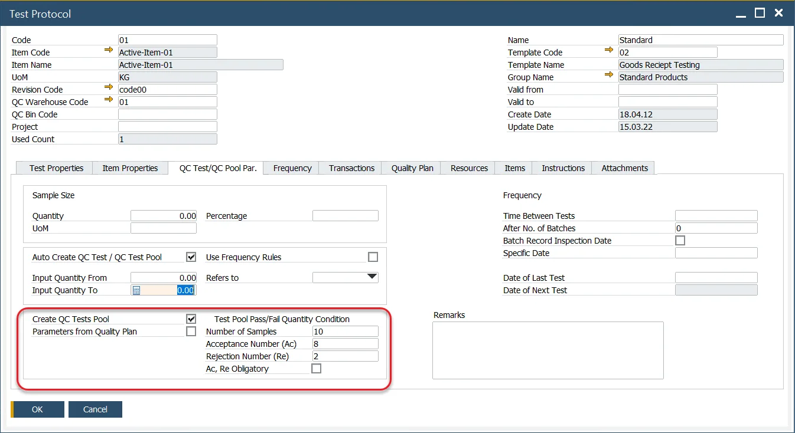

# Quality Control Tests Pool

The Quality Control Tests Pool evaluates the pass/fail status of tests based on a predefined relationship between passed and failed quality tests within a pool. This feature is designed for quality control processes involving multiple samples, automating the creation of a series of Quality Control Tests.

---

## Configuration

- **Create QC Tests Pool**: specifies if a QC Tests Pool will be generated for the Test Protocol.
- **Number of Samples**: indicates the number of individual tests (on various samples) in the QC Tests Pool.
- **Test Pool Pass/Fail Quantity Condition**: defines the conditions for the pool to pass or fail. Entering a value in one field automatically calculates the complementary value to equal the total number of samples.
- **Acceptance Number (Ac)**: the highest number of nonconforming units or defects in the sample that still allows the lot to be accepted.
- **Rejection Number (Re)** – the lowest number of nonconforming units or defects in a sample that leads to the rejection of the lot.
- **Ac. Re Obligatory**: determines whether the Acceptance and Rejection numbers are mandatory for releasing the QC order. If unchecked, the final result can be adjusted manually.
- **Parameters from Quality Plan** – click [here](quality-plan.md) to find out more about Quality Plan.

## Usage

:::info Path
    Quality Control → Quality Control Test Pool
:::

To use the function:

1. Open the Quality Control Test Pool form.
2. Select the pre-configured Test Protocol.
3. Choose the required Transaction Type to determine the inventory flow stage for the tests.
4. Select the corresponding document based on Series and Document Number.

Item details, along with the Required Acceptance and Rejection Number fields, will populate automatically. A list of individual tests is then generated, with the tests being created upon adding the Quality Control Test Pool.

Click Add after entering all required fields. You can then review and open each individual Quality Control Test from the pool.

---
