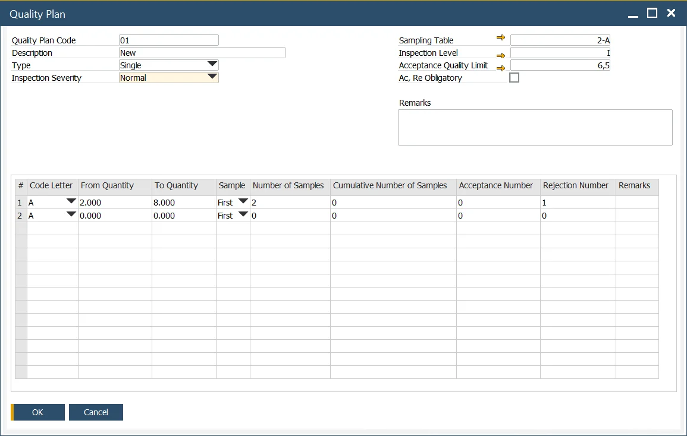
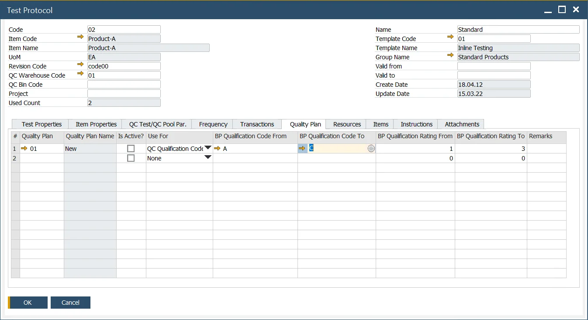

# Quality Plan

The Quality Control function reflects the ISO 2859-1 norm (Sampling procedures for inspection by attributes) in ProcessForce and and offers flexibility to customize it according to specific business needs. Therefore, it allows generating Quality Control Test Pool based on the norm's rules (Business Partners' ratings, Pass/Fail rules).

Adopting the Quality Control function based on the ISO 2859-1 standard can be a valuable asset for ensuring quality between your company and a business partner supplying you with items.

---

:::info Path
    Administration → Setup → Quality Control → Quality Plans
:::

## Business Impact

The ISO 2859-1 standard includes tables with statistical data that determine the number of samples to test in a batch (whether received from production or purchased), based on factors such as batch size, inspection severity, and the Business Partner’s rating. For example, for a batch of 10,000 units, the norm may specify ten samples, with at least eight passing the Quality Control Test for the entire batch to be accepted. The Quality Plan set up in ProcessForce directly influences the Quality Control Test Pools.

## Quality Plan Preparation

:::info Path
    You can find a detailed description of the ISO 2859-1 (methodology, terms, etc.) on the [International Organization for Standardization website](https://www.iso.org/obp/ui/#iso:std:iso:2859:-1:ed-2:v1:en).
:::

### Header

- **Quality Plan Code / Description**: – set your Code and Name
- **Type**:  Currently, only the "Single" option is available. The "Double" and "Multiple" options, along with related functionalities, are planned for future releases.
- **Inspection Severity**: this term is associated with ISO 2859-1. The measure of a sampling plan's performance capability is calculated based on the discrimination ratio and valuation severity (according to the DGQ - German Society for Quality). This measure identifies a standard, reduced, or tightened inspection. Sampling schemes referred to sampling plans for inspection severity or inspection severity and accepted quality level (AQL). By adjusting the inspection severity, businesses can balance the probability of acceptance with inspection efforts to suit varying quality conditions.
- **Sampling Table**: a Sampling table defined based on ISO 2859. Users can define a code and name for reference.
- **Inspection Level**: the inspection levels as defined in ISO 2859.
- **Acceptance Quality Limit**: the maximum fraction of nonconforming units (as a percentage) or the maximum number of defects per 100 units permitted for a lot to be accepted. The AQL (Acceptable Quality Level) is the quality level that represents the upper limit of a satisfactory average quality level for an acceptance sampling inspection.
The parameters above correspond to a specific column within a table from the norm (Table 2-A – Single Sampling Plans for Routine Inspection). The relevant column's data is presented in the table section below.
- **Ac Re Obligatory**: specifies whether the Acceptance and Rejection numbers from the table are mandatory for deciding the release of a Quality Control (QC) order. If unchecked, the final test results can be manually modified.

### Table

This table represents a recreated column from the ISO 2859-1 standard, focusing on specific product inspection requirements. Users can configure it as needed, as the entire table is often unnecessary for most cases. Suggested model settings are provided but can be adjusted to align with individual business needs.

- **Code Letter**: represents the sampling size based on Table 1 of ISO 2859-1, with values ranging from A to R.
- **From Quantity To Quantity**: specifies the lot size (batch) for which Quality Control Tests will be conducted.
- **Sample**: refers to the sampling type. Currently, only the First option is available; additional options for Double and Multiple types are planned for future updates.
- **Number of Samples**: indicates the number of samples required for a specific batch size.
- **Cumulative Number of Samples**: reflects the cumulative total of samples in double or multiple tests. This field is currently not in use as it applies to future Double and Multiple types.
- **Acceptance Number**: defines the highest number of nonconforming units or defects in the sample that still allows the lot to be accepted. The acceptance number in an attributive inspection corresponds to the acceptability constant in a variable inspection.
- **Rejection Number**: defines the lowest number of nonconforming units or defects in a sample that leads to the rejection of the lot.

## Usage

:::info Path
    Quality Control → Test Protocol
:::

Choose a Quality Plan in the Quality Plan tab.

To use the option:

1. Navigate to the Quality Plan tab within the Test Protocol form and choose the applicable Quality Plan.
2. Enable the Create QC Tests Pool checkbox and the Parameters from Quality Plan option in the QC Test/QC Pool Par. tab. These options can also be used alongside the Auto Create QC Test/QC Test Pool feature in the same tab.
3. Once the Quality Plan is selected, you can specify whether it is active.
4. Use the "Use for" field to determine whether Business Partners are identified based on their QC Qualification Code or QC Rating. These values are set in the Business Partner Master Data under the General tab.
5. Specify the range for Business Partner Qualification Code or Rating. Business Partners within this defined range will be subject to the Quality Plan.

The configuration shown in the screenshot demonstrates that Quality Plan 01 applies to Item Product-A for Business Partners with QC Qualification Codes ranging from A to C. This plan outlines the required number of samples to be tested for specific batch sizes and the ratio of passed to failed tests necessary for the batch to pass Quality Control.

---
