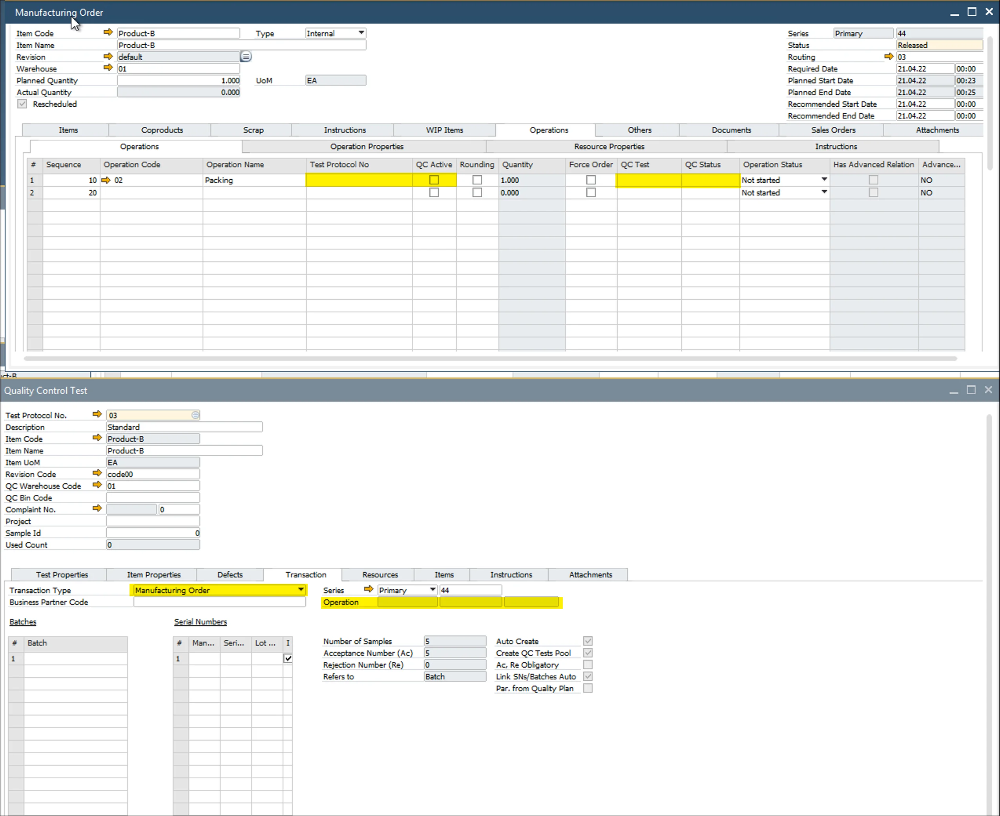
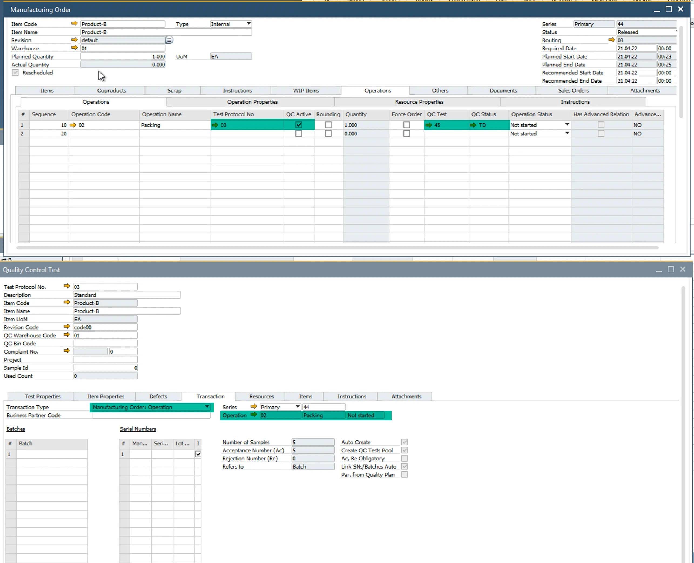

# Test Protocols for Operation

A Test Protocol can be designated for a specific Operation by navigating to the Transactions tab (Test Protocol → Transactions → Operation).

Alternatively, a Test Protocol can be linked to an Operation through the Production Process, Routing, or Manufacturing Order in the Operations tab.

While both methods result in the creation of a Quality Control Test, there are key differences between them:

|              Scenario               | Protocol Defined in Routing Based on Operation | General Settings > PF > QC - Create QC Document on MOR state | General Settings > PF > QC - Create QC Document for Operation on MOR state |                                                         Behavior                                                         |
| ----------------------------------- | :--------------------------------------------: | :----------------------------------------------------------: | :------------------------------------------------------------------------: | ------------------------------------------------------------------------------------------------------------------------ |
|        Create QC Based on MO        |                      :x:                       |                      :heavy_check_mark:                      |                                    :x:                                     | QC will be created based on MO. There won't be a link to Operation even though the operation is checked in test protocol |
|    Create QC Based on Operation     |               :heavy_check_mark:               |                             :x:                              |                             :heavy_check_mark:                             |                   QC will be created based on Operation. There will be a link between function and QC                    |
| Create QC Based on MO and Operation |               :heavy_check_mark:               |                      :heavy_check_mark:                      |                             :heavy_check_mark:                             |                  One for MO, one for operation linked will be created. Be careful with duplicated QCs.                   |

Based on Manufacturing Order:

Based on Manufacturing Order Operation:

## Example

For processes requiring a quality check before or after an operation (such as a "First Check"), the Test Protocol should be defined in the Routing, associating the QC check directly with the operation. In such cases, requirements like blocking the operation from starting through CompuTec PDC if the QC check (First check) has not been passed can be enforced.

---
