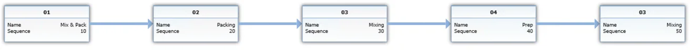
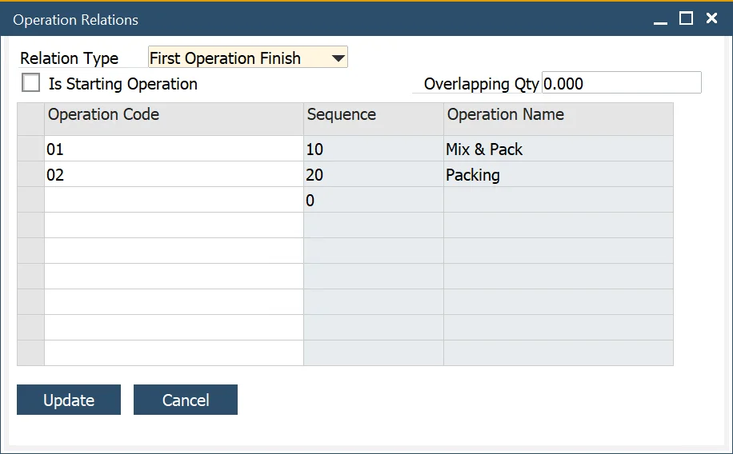
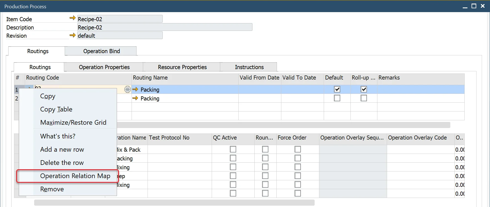
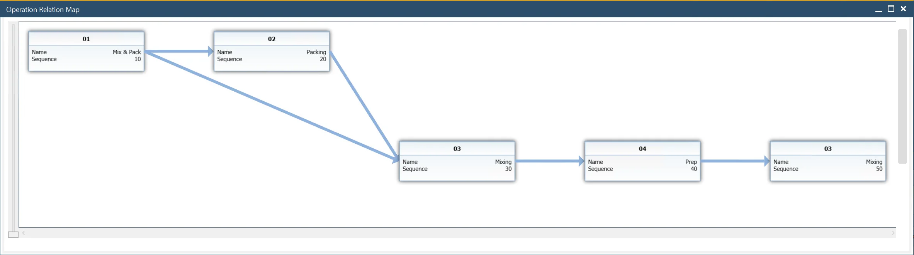

# Advanced Operation Relations

In earlier versions, operations could only be set up in a strict sequential order. However, with the introduction of Advanced Operation Relations, it is now possible to establish more complex dependencies between operations, allowing for greater flexibility and efficiency in production planning.

---

You can configure operation relations by right-clicking on an operation in the following locations:

:::note Path
    - Production → Routing → Routings → Operations tab
    - Production → Manufacturing Order → Manufacturing Order → Operations tab
    - Production → Bill of Materials → Production Process → Routings tab → Routings tab
:::

## Operation Relations

Advanced Operation Relations enable different types of dependencies between operations. This ensures better workflow management, improved scheduling, and reduced production bottlenecks.

Example Routing:

Standard sequence:

Available options:

**Relation Type**:

- **None**: the option is not used.
- **First Operation Finish**: a specified operation starts when the first chosen on Relation Operation form Operation is finished.

Example: Settings for Operation 04:

Result: Operation 04 starts when Operation 01 is finished

- **Last Operation Finish**: a specified operation starts when the last of the chosen Relation Operation form Operation is finished.

Result: Operation 04 starts when Operation 02 is finished.

**Is Starting Operation**: by selecting this option, an operation is designated as a starting operation, creating parallel sequences in the production process.

Example: for Operation 03 **Is Starting Operation** checkbox is checked:

**Overloading**: a specified Operation starts when the chosen on Operation Relation form Operation produces a specified quantity

### Advance Operation Relations Indicator

To check if an operation has advanced relations assigned, review the values in the following columns:

**Advance Relation Types**:

- **SO** – Is Starting Operation
- **FF** – First Operation Finish
- **LF** – Last Operation Finish

## Operation Relation Map

To better understand operation dependencies, you can visualize the connections through an Operation Relation Map.

You can reach this feature by right-clicking on Routing in the following locations

:::info Path
    Production → Manufacturing Order → Manufacturing Orders → Operations tab → Operations tab

    Production → Bill of Materials → Production Process → Routings tab → Routings tab
:::

Example Operations relations chart:

---
