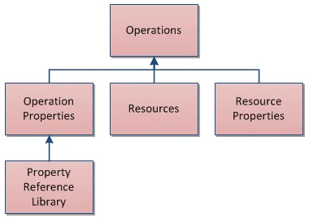
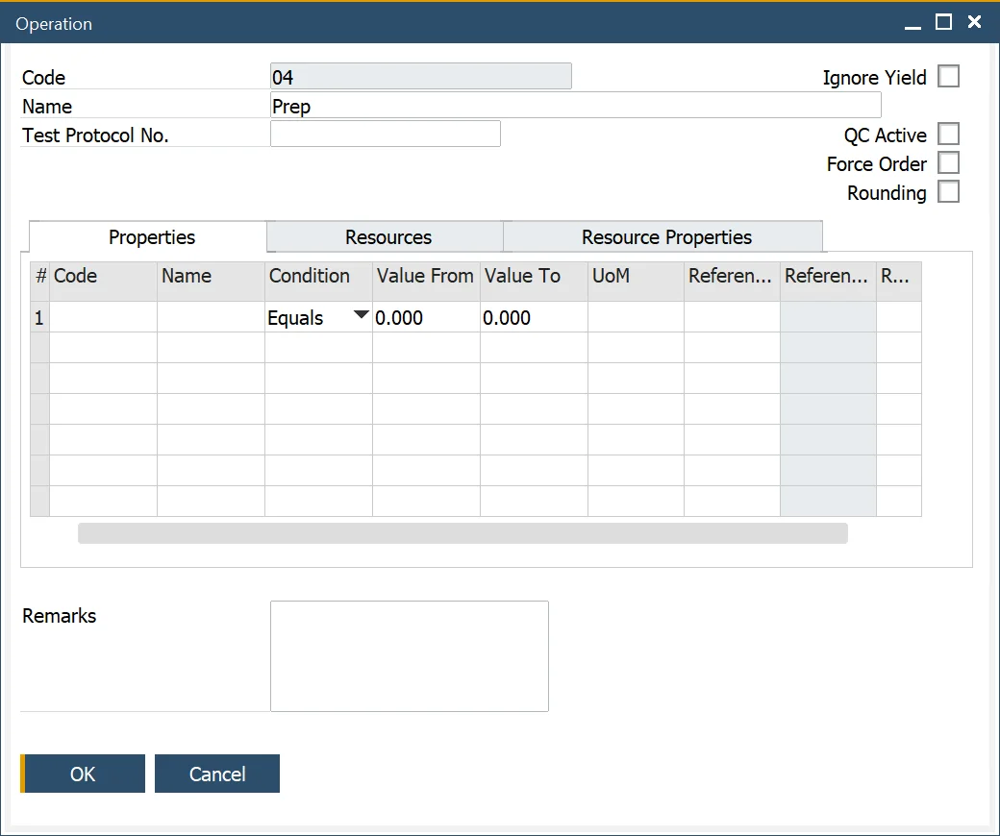
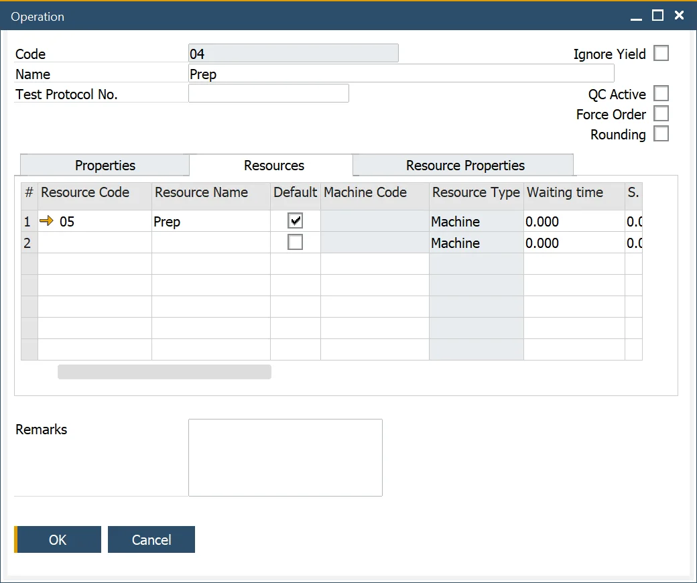
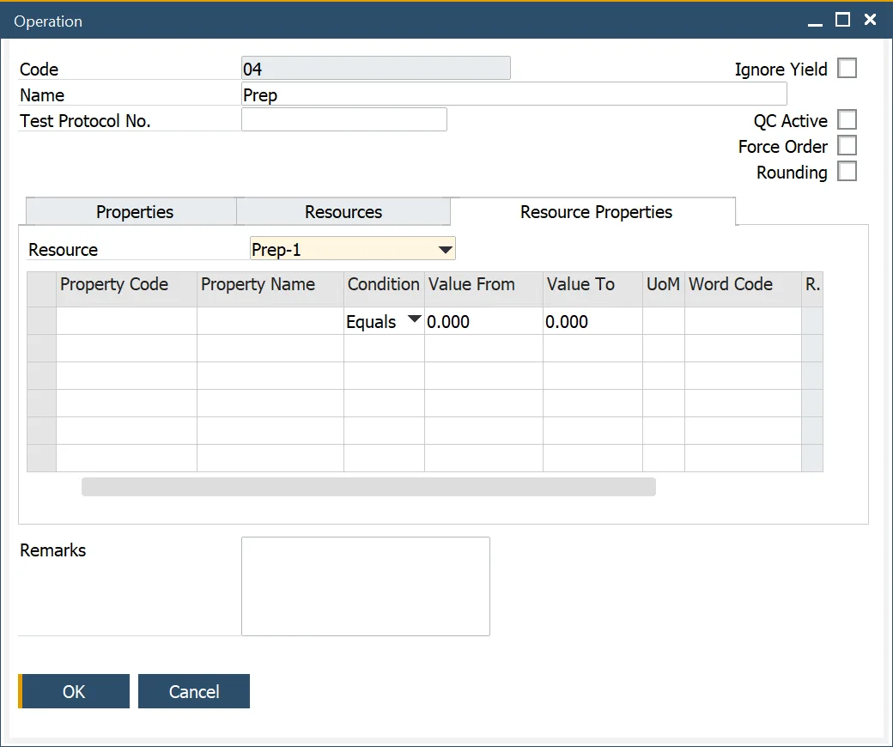
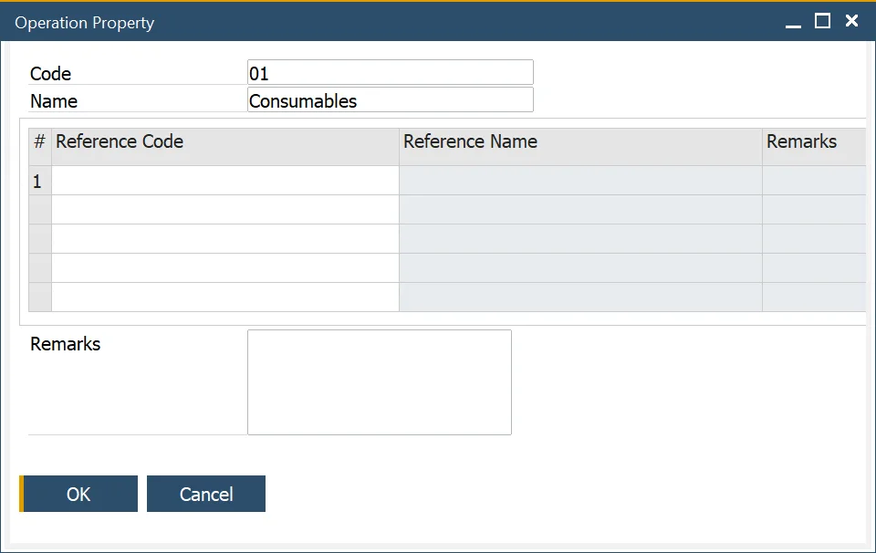
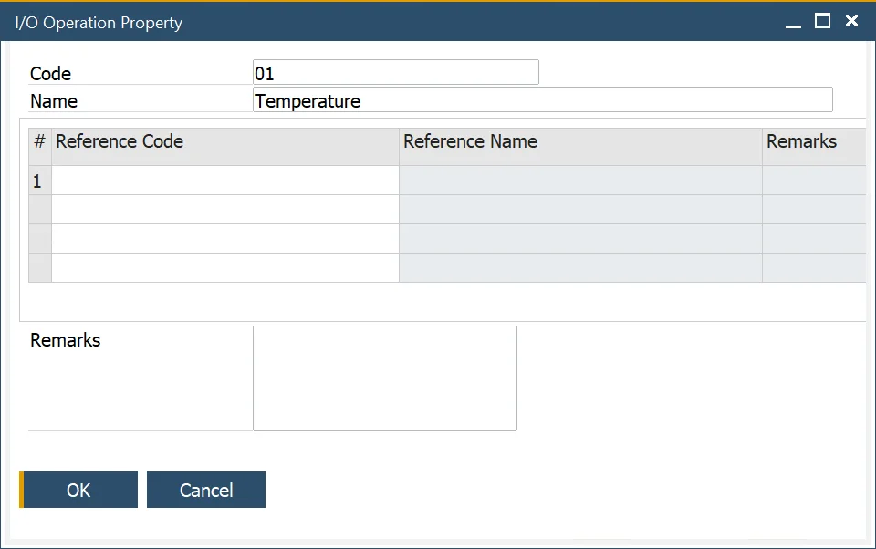

# Operations

In manufacturing, defining and managing operations is crucial for ensuring efficiency and consistency in the production process. This guide provides an overview of how to set up and configure operations, including properties, input/output specifications, and resource allocation.

To view related video content, click [here](https://www.youtube.com/playlist?list=PLtT6kgaz5YneralBjyvyCSYXbTT0QRHYx).

---

## Operations

To access Operations, navigate to:

:::info Path
Production → Routings → Operations
:::

Operations are key components of routings used in manufacturing products. This section explains how to define operations and configure their properties to optimize production processes.

### Header

#### QC Active

This checkbox determines whether a specific operation is subject to quality control (QC) based on the [Create QC Document for Operation on MOR status change option](/docs/processforce/user-guide/system-initialization/general-settings/qc-tab). It is also available at the Manufacturing Order, Production Process, and Routing form levels.

#### Force Order

Enabling this option ensures that an operation cannot start until the previous operation is completed. This restriction applies to bookings made in both ProcessForce and CompuTec PDC. It is also available at the Manufacturing Order, Production Process, and Routing form levels.

#### Rounding

When selected, this checkbox rounds the number of item pieces assigned to each resource to an integer.

**Example**

There is a Manufacturing Order with 5 pieces (pcs) in Planned Quantity. There are 4 Resources in an Operation. Without the checkbox checked, each Resource has 1,25 pcs assign (5 pcs by 4 Resources). Run Time is 8 h/pc.

If the Rounding checkbox is checked, the system will act the following way: 5 pcs : 4 Resources = round down to 1 and assign the remaining amount to the last Resource:

- 1st Resource: 1 pc x 8 h,
- 2nd Resource: 1 pc x 8 h,
- 3rd Resource: 1 pc x 8 h,
- 4th Resource: 2 pcs x 8 h.

Other distribution examples:

- 3 pcs : 4 Resources = 3 Resources, 1 pc each, the last Resource 0 pcs,
- 11 pcs : 4 Resources = 3 Resources, 3 pcs each, the last Resource 2 pcs.

The checkbox is also available from the Manufacturing Order, Production Process, Routing form level.

### Properties

- This tab allows the user to select, add and remove a number of properties for the operation.
- The user can select from a number of expressions to record a specific value or a from/to value dependent upon the expression.

### Resources

- This form allows the user to select, add and remove resources that are to be used within the operation.
- Multiple resources can be added, but one of the resources has to be selected as the default.
- The fixed and variable time element values and unit of rates of the selected resource are set as default in this tab.
- The user can change these default values if required for this specific operation/resource combination.

### Resource Properties

- The properties of the selected resource are set as default in this tab.
- This tab allows the user to select and add additional properties for this resource-operation combination and remove the defaulted values.

## Properties for Operations

To access Operation Properties, navigate to:

:::info Path
    Administration → Setup → Production → Operation Properties
:::

This form allows the user to define properties for the operation, for example, consumables.

## I/O Properties for Operations

To access I/O Operation Properties, navigate to:

:::info Path
    Administration → Setup → Production → I/O Operation Properties
:::

Users can define an operation's input and output properties to provide additional details about the production process, such as input and output viscosity levels.

