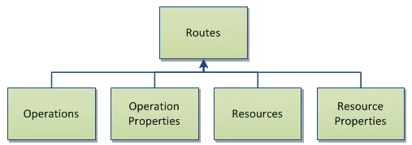
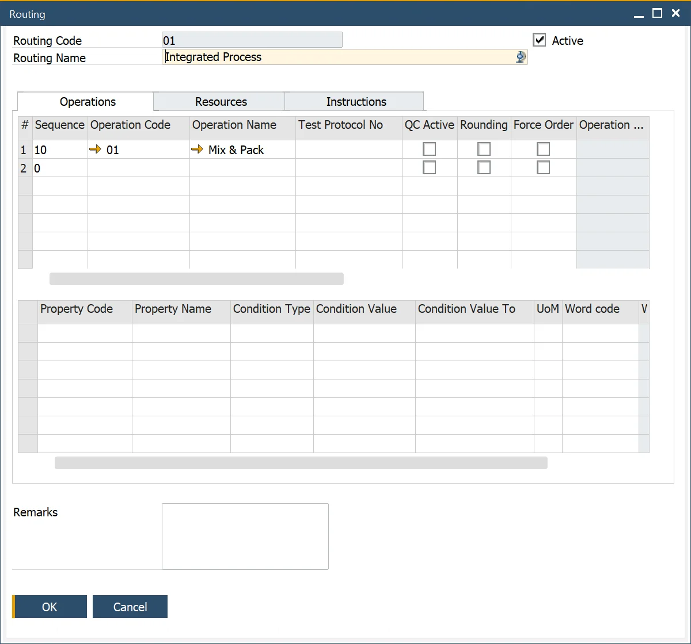
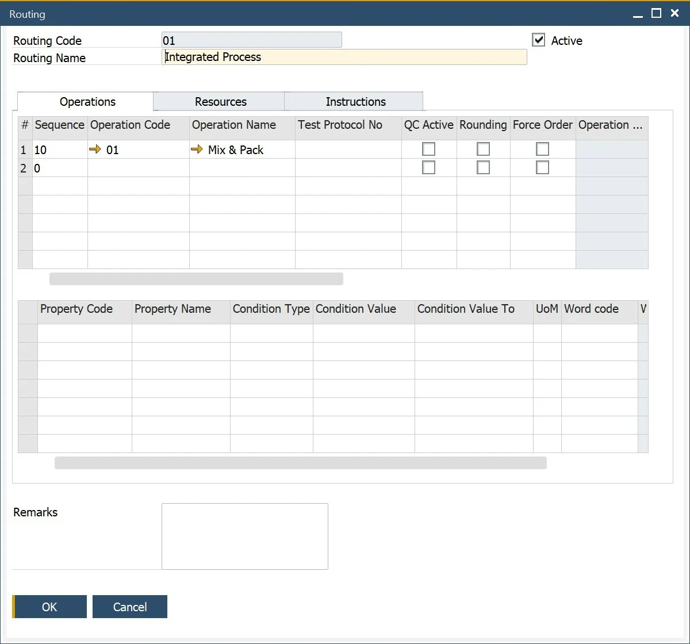

# Routing

Routing is a crucial aspect of production management, consisting of operations and resources that define the manufacturing process. It helps in structuring workflows, scheduling tasks, and allocating resources effectively. By configuring routing correctly, businesses can optimize production efficiency and ensure seamless execution of manufacturing orders.

You can define multiple routings for a product, but one must be set as the default within the corresponding Bill of Material (BOM). Additionally, routings can be activated or deactivated by checking the active checkbox in the form header. While optional, routings are highly beneficial when used alongside Bills of Materials and Manufacturing Orders.

---

To access Routing, navigate to:

:::info Path
    Production → Routings → Routing
:::

## Adding and Changing Operation Data

The Operations section allows users to select, add, or remove operations within a routing. Additionally, users can define overlay operations that run parallel to base operations and set overlay percentages. This data is essential for scheduling and optimizing production workflows.

## Operation Properties

When a user selects an operation from the top grid, the corresponding properties are displayed in the lower grid. These properties are pre-filled by default but can be modified as needed. Additional operation properties can also be added or removed, ensuring flexibility in defining process parameters.

## Adding and Changing Resource Data

The Resources section allows users to manage resources associated with operations. Users can select, add, or remove resources and configure their details.

A drop-down selection enables users to choose pre-defined resources linked to an operation, pulling default information from the [Operations](./operations.md) definition.

This grid allows the user to select and add additional resources for this operation/routing combination and remove the defaulted resources.

The fixed and variable time elements values and unit of rates of the selected resource/operation are filled in by default in this tab.

The user can change these default values if required for this specific route/operation/resource combination.

The yellow arrow navigates to:

:::info Path
Production → Technology → Resources → Resources
:::

## Resource Properties

Data is presented to the user within the grid when the user selects the row within the top grid. The properties of the selected resource/operation are set by default in this grid based on the [Resource](resources.md) definition. This grid allows the user to select and add additional properties for this resource/operation/routing combination and change or remove the default values.

## Instructions tab

The Instructions tab provides an editable text area for entering relevant information such as production guidelines, notes, and additional instructions. This ensures that all essential details related to a routing process are documented for easy reference.

---
