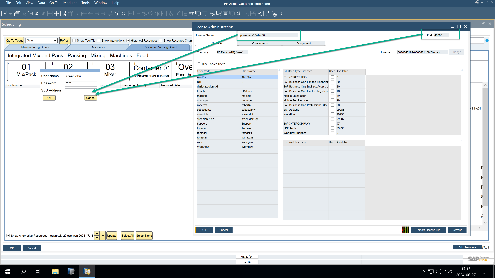

# Material Shortage

Effective material and tool management is essential for smooth manufacturing operations. The Material Shortage functionality provides comprehensive planning and tracking capabilities to help businesses manage shortages of production equipment and materials.

This functionality aims to:

- plan tools within the Gantt chart
- trace tools and material shortages (defined as traced) within the Gantt chart, along with information about the planned supply (first delivery)
- trace tools and material shortages (defined as traced) in the Tools/materials shortages report and information about all the planned supplies

---

## The Gantt Chart Functionality

### Configuration

#### Item Master Data

There are two related checkboxes in the Item Master Data form:

    

- **Production Equipment** (tool, set): items marked as production equipment can be filtered on the Gantt chart. Selecting this checkbox automatically enables Shortages Tracking.
- **Shortages Tracking**: if checked, the item is included in the shortage report and highlighted on the Gantt chart as part of the shortages tracking functionality.

### Usage

The Gantt chart includes a Shortages checkbox in its header, allowing users to toggle visibility for production equipment and material shortages. Shortages are visually marked with a red line on Manufacturing Orders within the Gantt chart. Additionally, a dynamic Floating Panel provides real-time updates on shortages as changes occur.

1. The floating Panel is visible if the Shortages checkbox is checked:

    1. By default, both Production Equipment and Materials checkboxes are selected. In the Floating Panel, all items with shortages for all Manufacturing Orders are shown, marked with a shortage indicator according to the settings in General Settings (Only Items with Shortages Tracking).
    2. If the Production Equipment checkbox is not checked and Materials is selected, Production Equipment will not be visible in Floating Panel.
    3. If the Production Equipment checkbox is selected and Materials is not selected, only Production Equipment will be visible in Floating Panel.
    4. Always one of them (Production Equipment or Materials) has to be selected.
2. Upon start, Floating Panel contains information for all Manufacturing Orders with shortage marker. Users can select a particular Manufacturing Order on Gantt; then, the floating panel is constrained to the specified Manufacturing Order.
3. The Floating panel is dynamic – changes on Gantt are on the fly and considered in the panel calculations.

## Shortages Report

To access the shortage report, the user must click "Load" at the top of the Gantt chart, enter their SAP credentials, and specify the SLD address in the format "License server:port".

### Configuration

Key settings impacting the Shortages Report include:

- **Only Item with Shortage Tracking**: determines whether the report and Gantt chart display all items or only those flagged as "Shortage Tracking" in the Item Master Data.
- **Include Obsolete Supply/Demand Documents**: determines if quantities from supply and demand documents with a delivery date on or before the current date are factored into the Opening Balance Quantity in the Shortage Report.
- **Shortage considered separately for each warehouse** - indicates whether the report calculates shortages based on demands and supplies from the same warehouse (as defined in the Manufacturing Order's Items tab) or across all warehouses.

### Usage

The Shortages Report tab in the Gantt chart displays shortages for each item and revision. It includes historical and current supply and demand transactions, along with graphical representations of available quantities versus shortages.

---
