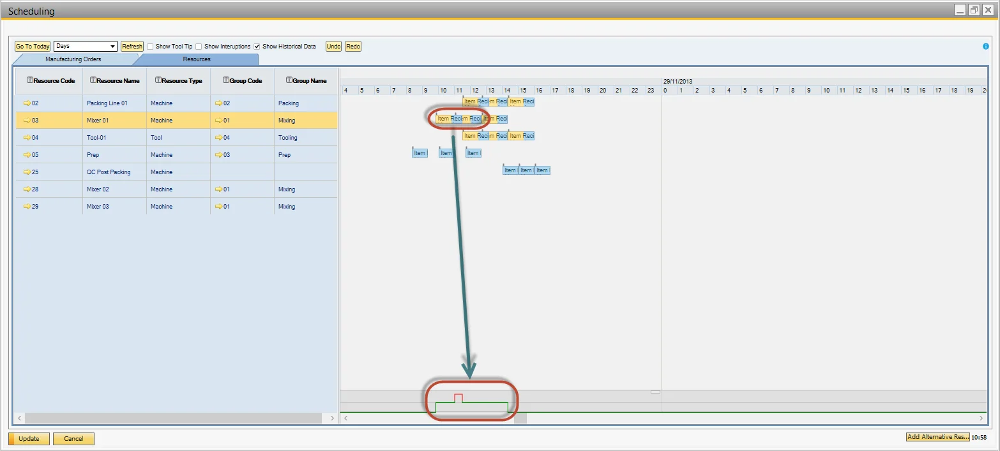
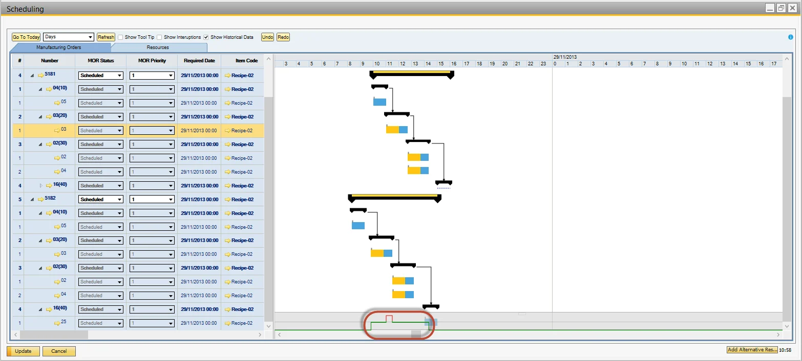

# View Planned Resource Capacity

This section explains how to view and manage the planned capacity of resources. Monitoring resource capacity helps ensure efficient scheduling and prevents overloading, enabling smooth production processes.

---

## Resources tab

- Select the desired resource by clicking on its row.
- The bottom of the Gantt chart displays the consumed capacity.

    
- Drag a resource block to a different period.
- Capacity is auto-calculated and displays overload.

    

## Manufacturing Orders tab

Follow the same navigation steps as described above to view resource capacity in the Manufacturing Orders tab.

---
