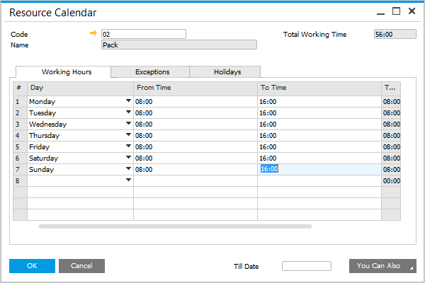
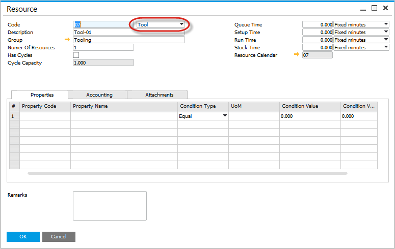
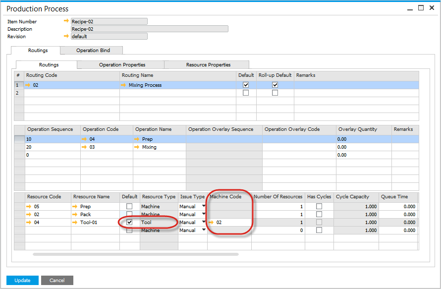

# Overview

The ProcessForce scheduling solution enables effective management of Manufacturing Orders (MOs) within the plant. It facilitates production planning by accounting for factors such as resource availability, time constraints, and overlapping processes. The solution features an interactive and flexible Gantt chart that allows users to easily modify schedules as needed. Additionally, advanced filtering options—such as MO number, dates, planned start and end times, distribution rules, projects, Sales Order numbers, or Customer Codes—allow users to display specific data tailored to their requirements.

---

## Master Data

### Resources

Resources are the backbone of production scheduling. Setting up and managing resources ensures efficient utilization within the plant.

Click [here](../routings/resources.md) to find out more about resources and how to set them.

To view related videos on Resources, click [here](https://www.youtube.com/playlist?list=PLtT6kgaz5YneralBjyvyCSYXbTT0QRHYx).

### Calendars

Properly configured Resource Calendars ensure accurate planning by considering working hours, holidays, and availability.

Click [here](./resource-calendar.md)to find out more about setting up Resource Calendars.

To view related videos, click [here](https://www.youtube.com/playlist?list=PLtT6kgaz5YneralBjyvyCSYXbTT0QRHYx).

### Tooling

Managing tooling is critical for achieving precise production schedules.

To view additional documentation, click [here](./resource-calendar.md).

---
