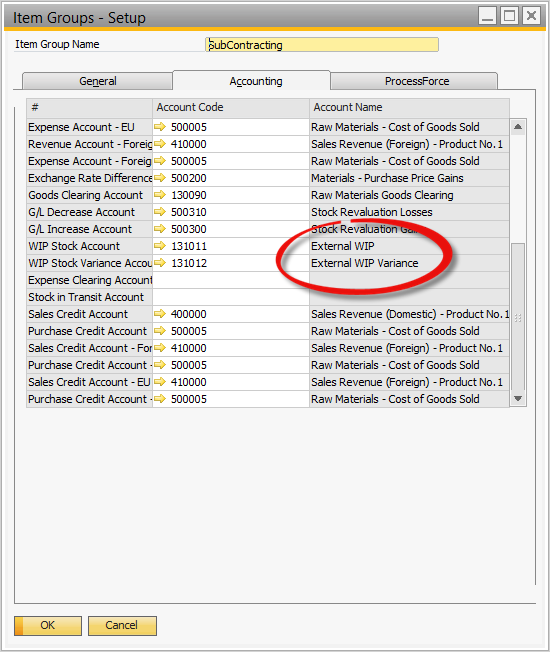
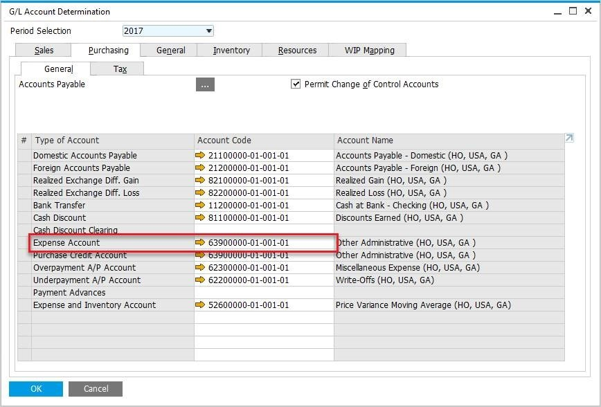

# General Ledger Settings

In managing subcontractor processes, it is essential to ensure accurate accounting and financial visibility. This section outlines how the general ledger settings are configured to account for inventory consumed at a subcontractor and how financial postings are managed for both inventory and production activities. By setting up the right accounts, businesses can track production values and maintain clear records of subcontractor transactions.

---

## Overview

- Inventory consumed at a subcontractor is accounted for in the same way as production within a manufacturer.
- Financial postings are made to an External WIP account when inventory is issued and received, ensuring that the production value at the subcontractor is accurately tracked.

## Account Settings

- Following SAP Business One rules, accounts can be set at various levels including Warehouse, Item Group, and Item, or through Advanced G/L Account Determination.
- For WIP Inventory and Inventory Variance Accounts, account codes for External WIP and WIP Variance need to be defined at the appropriate level (based on the implementation decision).

    
- Expense Account has to be set up for Service Items.

    

---
