# Process Flow

Subcontracting is an essential process in manufacturing that involves outsourcing specific tasks or services to external suppliers. This guide outlines a detailed step-by-step process to effectively utilize the subcontracting function by adding items to a manufacturing order. Following these steps ensures smooth execution, accurate record-keeping, and seamless integration within SAP Business One.

---

## Create a Manufacturing Order

- The order type defaults to "External".
- The Subcontractor Code (found on the "Others" tab) is automatically populated based on the item purchased for the service.

    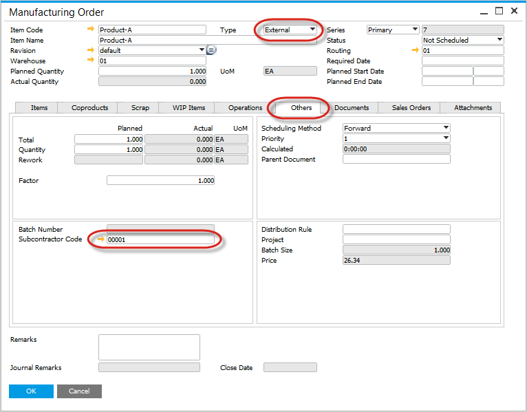

## Create a Purchase Order for the Service

- Use the context menu in the manufacturing order to generate a related purchase order.
    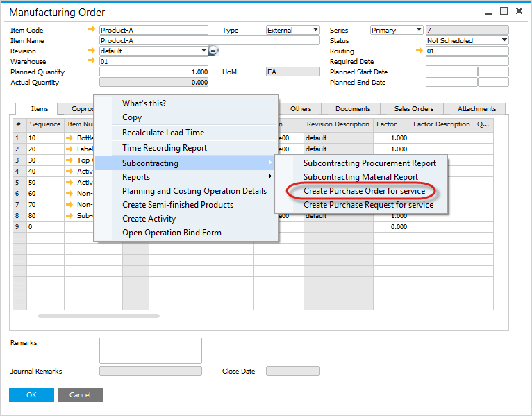

- Alternatively, configure automatic generation of purchase orders or purchase order requests for subcontracting tasks after posting the manufacturing order. You can check how to do that [here](../../system-initialization/general-settings/subcontracting-tab.md)

### Purchase Order is created

- Supplier Code defaults from the subcontractor code in the manufacturing order.
- Manufacturing Order number is copied into the Purchase Order for reference.
- Planned Quantity of the Service item is copied into the Purchase Order.
- Price of the Item defaults from the SAP Business One Price List.

### Review Related Purchase Orders

- Access the Subcontracting Procurement Report via the context menu in the manufacturing order.

    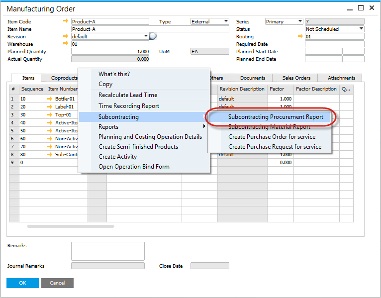

- This report lists all purchase orders linked to the manufacturing order for easy tracking.

    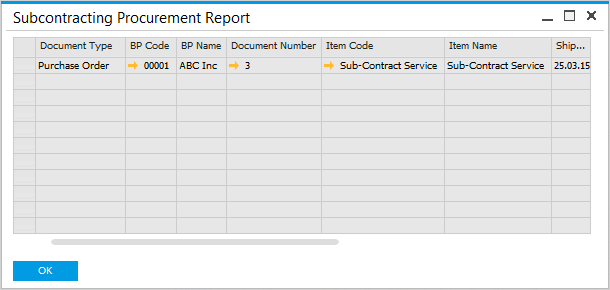

## Move Inventory Items to Subcontractor Warehouse

- Use Transfer All Components to move all inventory associated with the manufacturing order, regardless of what has already been transferred.
- Use Transfer Components to move only the required inventory. If no transfer occurs, it indicates that sufficient inventory is already available in the subcontractor’s warehouse for the manufacturing order.

    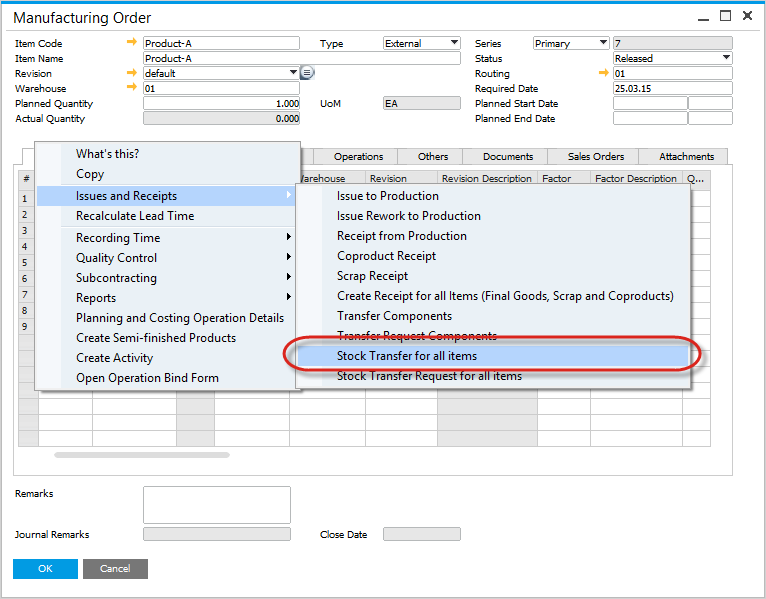

### Inventory Transfer

- An Inventory Transfer document is created.
- Business Partner defaults from the Manufacturing Order
- The Items and To Warehouse fields are prefilled with details from the manufacturing order.

    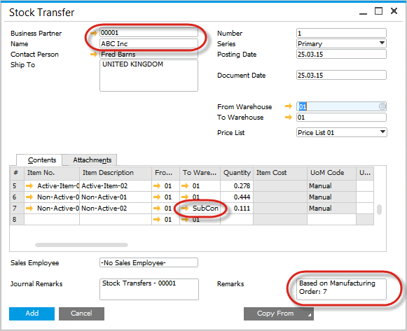

### Batch Number Selection

- If the Item is Batch Traced, have to select the batch to be issued,
- For items set to Backflush, CompuTec ProcessForce will automatically backflush batches according to the queue definition specified in the item details, such as FIFO, FEFO, or FMFO.

    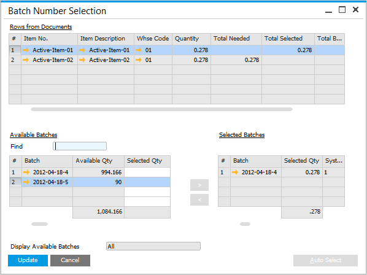

### Subcontracting Materials Report

Select this function to view the Inventory Transfers related to the manufacturing order.

    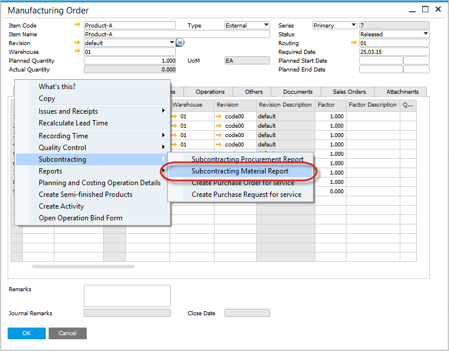
    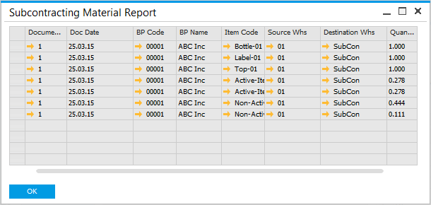

### Inventory Data

The Inventory Transfer moves inventory from the central warehouse to the subcontractor's warehouse.

    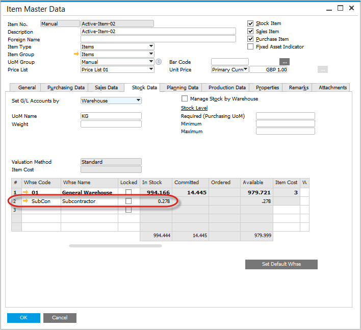

## Manually Pick Inventory

**Recording Inventory Usage**

To manage inventory issued by the subcontractor, navigate to the Issues and Receipts menu and select Issue to Production.

    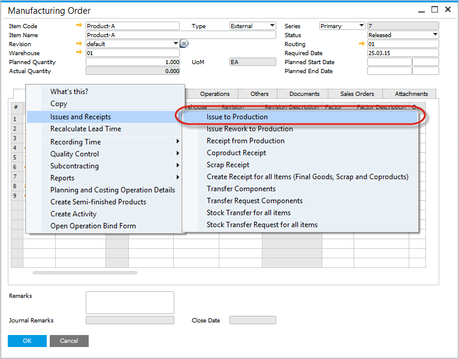

### Recording Inventory Usage

To handle inventory issued by the subcontractor, go to the Issues and Receipts menu and choose Issue to Production.

### Pick Order

- Enter the amount of inventory consumed.
- Business Partner is copied from the Manufacturing Order.
- The Warehouse serves as the source for inventory reduction.
- The External WIP account code will be used for journal postings.

### Batch Number Selection

If the item is batch-managed, select the appropriate batch number.

### Create the Production Issue

This action generates the SAP Goods Issue document and the corresponding financial posting.

### Journal Entry

A journal entry is created, recording the inventory value under the External WIP account.

## Record Subcontract Production

After production is completed, use the Receipt from Production function to record the finished product:

    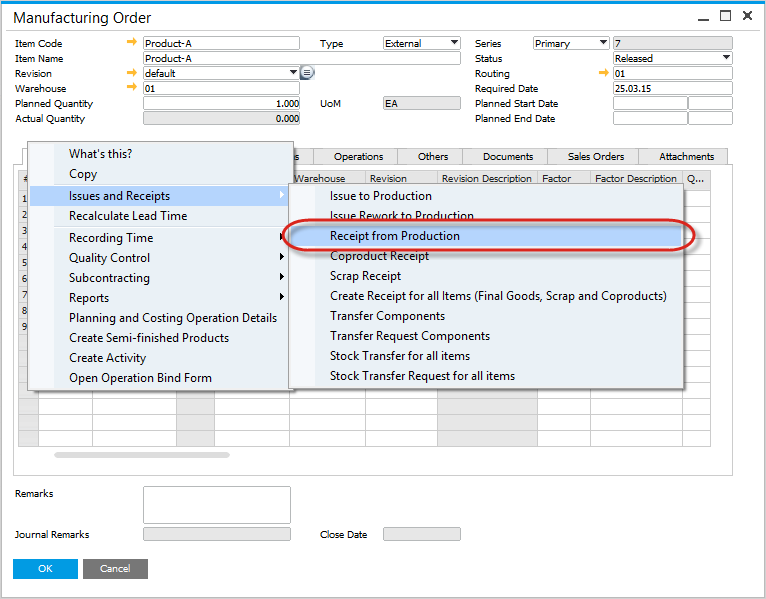

### Pick Receipt

- Enter the quantity produced by the subcontractor.
- Business Partner defaults from the Manufacturing Order.
- External WIP account defaults from the SAP Business One settings/configuration.
- Production Receipt is created,
- SAP Goods Receipt is created, and the corresponding financial postings.

### Purchase Order Goods Receipt

Upon completing the receipt from production, a Goods Receipt PO is automatically created for the subcontract service purchase order. Key actions include:
    - Recording the Goods Receipt PO in the Documents Tab for reference.
    - Creating a journal entry for the service item to ensure financial postings are complete.

---
