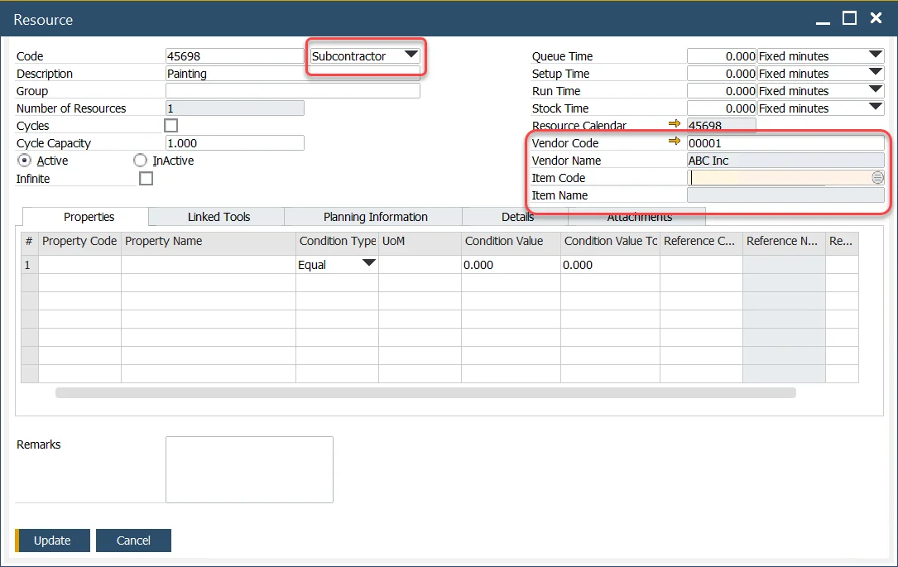
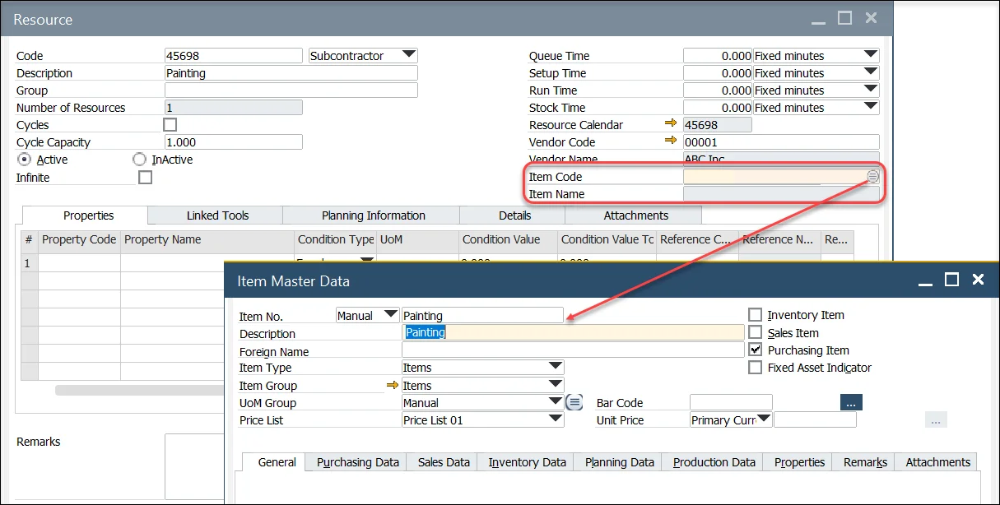
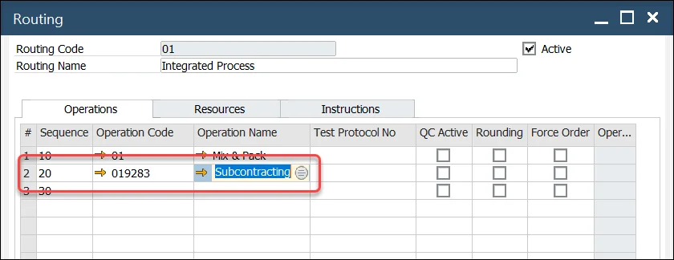

# Subcontractor Type Resource

Incorporating subcontracting into production processes can optimize operations and leverage external expertise. This is achieved by creating subcontractor-type resources, adding them to an operation, and integrating that operation into the routing. Below is a step-by-step guide to setting up subcontractor-type resources effectively.

---

## Resources

To set up a subcontractor-type resource for a service performed by an external organization:

1. **Select the Resource Type**

    Choose the resource type as "Subcontractor." Once selected, additional fields will appear for further configuration.

        

2. **Specify the Vendor**

    Identify the supplier performing the service by filling out the Vendor Code and Vendor Name fields.

3. **Select the Item**

    Choose an item that is defined as a non-inventory item and is marked as purchased.

        

4. **Define the Operation**

    Establish the operation involving the subcontractor and include it in the routing. This ensures the process is seamlessly integrated into the production flow.

        

---
