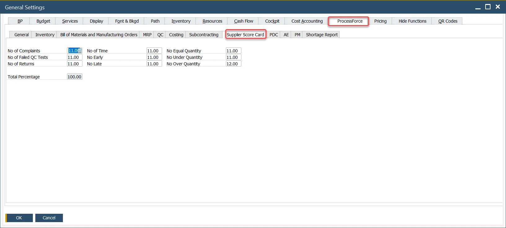
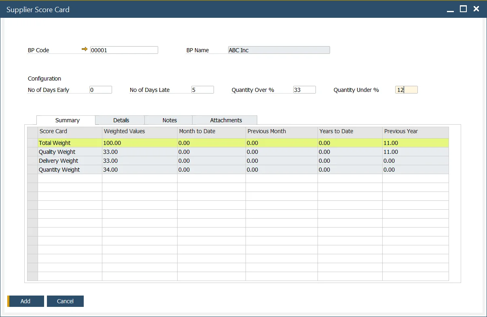
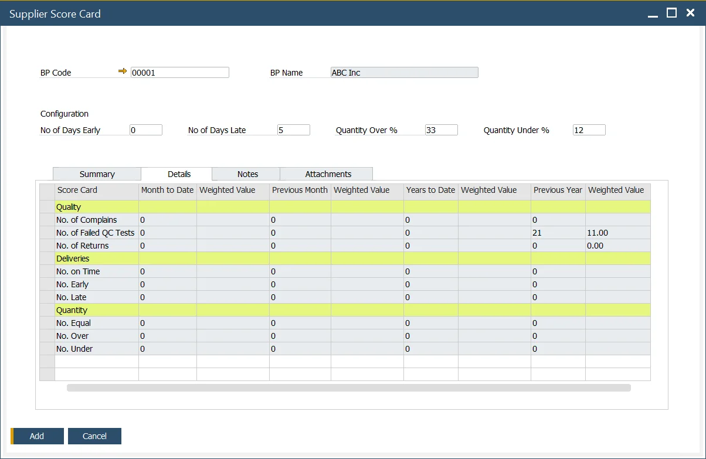

# Supplier Score Card

ProcessForce Supplier Score Card is a reporting function based on a weighted supplier scorecard. The ProcessForce Supplier Score Card is a powerful tool that enables businesses to assess and evaluate supplier performance in key areas, including quality, quantity accuracy, and delivery punctuality. By utilizing a weighted scorecard system, this feature allows organizations to track and measure supplier performance through a detailed, easy-to-read report. This process provides actionable insights, helping businesses foster stronger supplier relationships and optimize their procurement strategies.

---

:::warning
    - The delivery and quantity calculations on the Supplier Score Card are based on the relationship between Purchase Order and Goods Receipt PO documents. It is crucial that a specific Purchase Order and corresponding Goods Receipt PO are linked correctly for the function to work properly. This can be achieved by creating a Goods Receipt Purchase Order using the "Copy To" option from a Purchase Order, or by linking the Purchase Order using the "Copy From" option in the Goods Receipt PO.
    - Please note that dates are compared between the individual lines of the documents, not the document header dates.
:::

## Settings

### General Settings

:::info Path
    Administration → System Initialization → General Settings → ProcessForce tab → Supplier Score Card tab
:::

Here, you can define a number of values connected to Supplier (which have to add up to 100%), which defines a rank of specific value. These settings are created based on the weighted Supplier scorecard idea.

## Supplier Score Card

:::info Path
    - Business Partners → Supplier Score Card
    - You can also access the form for a specific Business Partner from the Business Partner form header context menu (available only when the BP type is set to Supplier for this Business Partner).
:::

### Header

In this section, you can define additional settings for a specific Supplier related to delivery and quantity.

- No of Days Early and No of Days Late define a period before and after the order date in which delivery is still acceptable.

    **Example**

      - The order date is 16.11.2016
      - No of Days Early: 2
      - No of Days Late: 2
      - Every delivery before 14.11.2016 will be deemed as early, and every delivery after 18.11.2016 will be considered late.
- Quantity Over % and Quantity Under % define a range of quantity of delivery that is still acceptable.

    **Example**

      - The ordered quantity is 100.
      - Quantity Over %: 10
      - Quantity Under %: 10
      - Every delivery less than 90 will be deemed too small, and delivery more than 110 will be considered too big.

### Summary

**Weighted Values**: these are predefined in the General Settings and correspond to factors like the number of complaints, failed QC tests, returns, etc.

**Month to Date** - This refers to the total number of transactions in the current month. For example, if today is October 15, the transactions from October 1 to October 15 are included.

**The Previous Month** - the weighted values calculated in the last month.

**Year to Date** - The cumulative weighted values for the current year, from January to the current month.

**The previous year** - the cumulative weighted values for the previous year, from January to December.

### Details

On this tab, the values from the Summary tab are broken down into specific weighted scorecard positions.

The values in the Details tab are displayed solely based on specific settings and transactions, e.g., QC Tests, Returns, etc.

#### Details tab Calculation

Note Grade = Amount / Total and Weighted Score = Weight x Grade

|        Quality         |                        No of weighted                        |                                              Weighted Value                                              |
| :--------------------: | :----------------------------------------------------------: | :------------------------------------------------------------------------------------------------------: |
|   No. of Complaints    |      A = Total Number of Complaints (for this supplier)      | ( A / Total number of Complaints (for all suppliers) ) x No of Complaints (value from General Settings)  |
| No. of Failed QC Tests | B = Number of Failed Tests (QC Test has the status = Failed) | ( B / Total number of QC Tests (Passed + Failed) ) x No of Failed QC Tests (value from General Settings) |
|     No. of Returns     |                    C = Number of Returns                     |               ( C / Total number of GRPO's ) x No of Returns (value from General setting)                |

| Deliveries  |                                                         No of                                                         |                             Weighted Value                             |
| :---------: | :-------------------------------------------------------------------------------------------------------------------: | :--------------------------------------------------------------------: |
| No. On Time |              D = Total number of GRPOs where the GRPO Posting Date is = to Purchase Order Delivery Date               | ( D / Total number of GRPO ) x No on Time (value from General setting) |
|  No. Early  | E = Total number of GRPOs where the GRPO Posting Date - No of Days Early Value is < than Purchase Order Delivery Date |  ( E / Total number of GRPO ) x No Early (value from General setting)  |
|  No. Late   | F = Total number of GRPOs where the GRPO Posting Date + No of Days Late Value is → than Purchase Order Delivery Date  |  ( F / Total number of GRPO ) x No Late (value from General setting)   |

| Quantity  |                                              No of                                              |                            Weighted Value                             |
| :-------: | :---------------------------------------------------------------------------------------------: | :-------------------------------------------------------------------: |
| No. Equal |       G = a Total number of GRPOs where the Purchase Order and GRPO quantity are the same       | ( G / Total number of GRPO ) x No Equal (value from General Settings) |
| No. Over  | H = Total number of GRPO where the quantity is → the Purchase Order quantity + Quantity Over %  | ( H / Total number of GRPO ) x No Over (value from General Settings)  |
| No. Under | I = Total number of GRPO where the quantity is < the Purchase Order quantity - Quantity Under % | ( I / Total number of GRPO ) x No Under (value from General Settings) |

### Notes

You can add any relevant comments or observations related to the scorecard.

### Attachment

Here you can add, display or delete files connected to the Score Card.

## Usage

1. Activate the Supplier Score Card form.
2. Select the supplier you wish to assess.
3. Fill in exceptions like delivery delays or quantity discrepancies.
4. Add document  as necessary for additional context.
5. Find/load created Supplier's Score Card.
6. Review Summary and Details.

---
