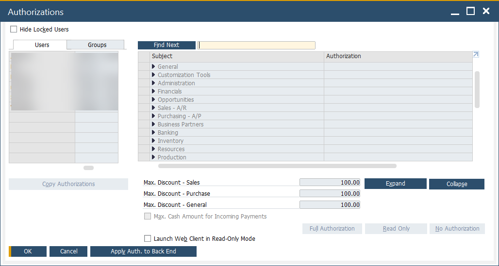

# Authorizations

User authorizations in **CompuTec ProcessForce** determine who can access, view, and perform operations on various documents and functions. Properly configuring authorizations ensures operational control, data security, and compliance with company policies.

---

## Setting Authorizations for Users

To manage user permissions:

1. Go to:
    :::info Path
   Administration → System Initialization → Authorizations → General Authorizations
   :::

   

2. Click a username to open the authorization settings for that user.

3. Navigate to:
    :::info Path
   Authorizations Form → Users → ProcessForce
   :::

---

## Authorization Levels

Each CompuTec ProcessForce-related function can be assigned one of the following access levels:

- **Full Authorization**: Create, modify, and post documents.
- **Read Only**: View content without making changes.
- **No Authorization**: Access is completely restricted.

    

    > If options are grayed out, the user has **superuser privileges**.

To assign superuser status:

- Navigate to:
    :::info Path
    Administration → Setup → General → Users
    :::

    

> ⚠️ Only users with a **Professional license** can modify authorizations.

---

## Required Authorizations for Key Transactions

To work with specific CompuTec ProcessForce documents (e.g., production-related inventory transactions), users need the following permissions:

- **Goods Receipt and Goods Issue**: Authorizations form → Inventory → Inventory Transactions → Goods Receipt [and] Goods Issue
- **Journal Entry**: This setting is required for Goods Receipt and Goods Issue to reflect on financials: Authorizations Form → Financials → Journal Entry
- **Pick Receipt and Pick Order**: User Authorization → ProcessForce → Production → Inventory Transaction → Pick Receipt [and] Pick Issue
- **Numbering Series**: This is needed for documents series management: Authorizations form → Administration → Numbering Series.

---

## Understanding User Authorization Behavior

- **Granular Control**: Authorizations are assigned per user and per feature, offering precise control over system access.
- **Superuser Override**: Users with superuser status automatically have full access to all forms and transactions.
- **Dependency on License Type**: Only users with a **Professional license** can be granted or edit authorizations.
- **Integration with SAP Business One**: CompuTec ProcessForce leverages SAP's built-in authorization framework to control access uniformly across modules.

---

## Troubleshooting Access Issues

If a user:

- Cannot access or modify a document: Ensure they have **Full Authorization** for the relevant transaction type.
- Can’t see any CompuTec ProcessForce options: Verify the user has been assigned CompuTec ProcessForce authorizations under their user profile.
- Sees all settings grayed out: Check if they are set as a **superuser** (which overrides manual configuration).

---

For additional guidance, contact CompuTec Support.

---
