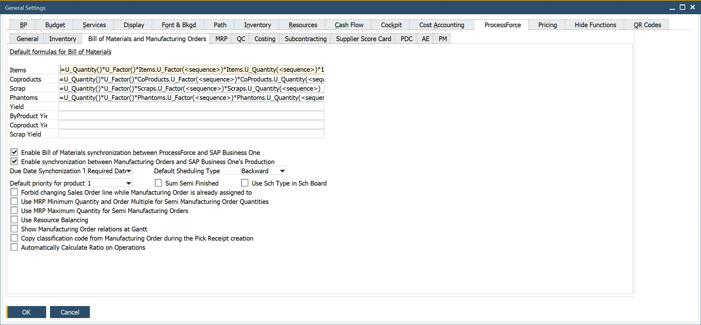
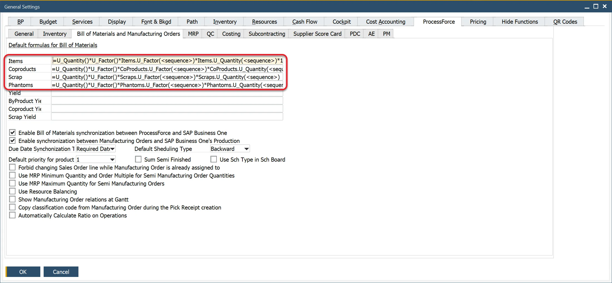
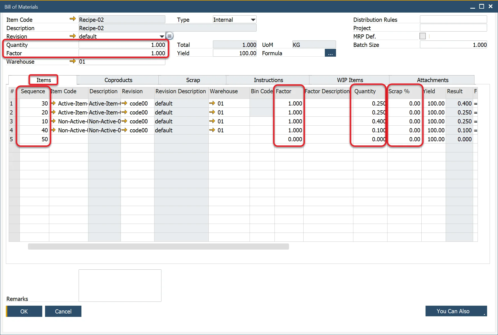
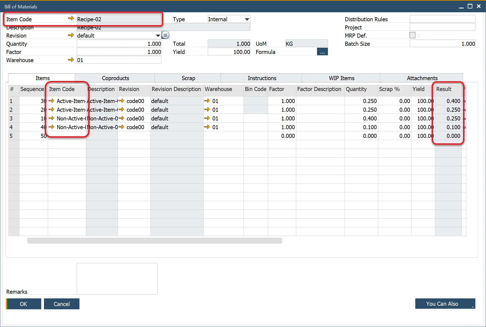
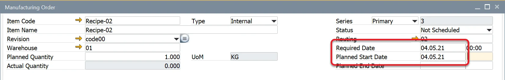
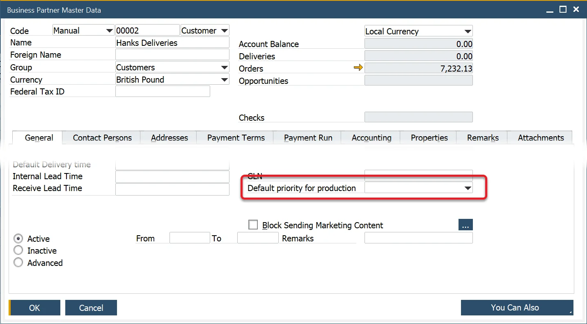

# Bill of Materials and Manufacturing Orders tab

This section provides detailed configuration options for managing Bills of Materials (BOM) and Manufacturing Orders (MOR) within ProcessForce. The tab allows users to define default calculation formulas, manage SAP synchronization, set manufacturing priorities, and optimize planning for semi-finished products.

This document outlines the key features and functionalities available in this tab to help users better understand and configure their manufacturing operations effectively.

To access Bill of Materials and Manufacturing Orders tab, navigate to:

:::info Path
Administration → System Initialization → General Settings → ProcessForce tab → Bill of Materials and Manufacturing Orders tab
:::



---

## Default Formula for Bill of Materials

CompuTec ProcessForce offers a versatile approach for defining the relationships between parent items, coproducts, scrap, phantoms, scrap percentages, and factors.

When a Bill of Material is created, these default formats are automatically assigned to each item. The formula, as shown, is included in this tab during the installation of ProcessForce.



### Default Formulas

Items:

```sql
=U_Quantity()*U_Factor()*Items.U_Factor(<sequence>)*Items.U_Quantity(<sequence>)*100/(100 - Items.U_ScrapPercentage(<sequence>))
```

Coproducts:

```sql
=U_Quantity()*U_Factor()*CoProducts.U_Factor(<sequence>)*CoProducts.U_Quantity(<sequence>)
```

Scrap:

```sql
=U_Quantity()*U_Factor()*Scraps.U_Factor(<sequence>)*Scraps.U_Quantity(<sequence>)
```

Phantom

```sql
=U_Quantity()*U_Factor()*Phantoms.U_Factor(<sequence>)*Phantoms.U_Quantity(<sequence>)
```

Naming:

|                          Items Tab                          |                       Coproducts Tab                        |                        Scrap Tab                         |                       Phantoms Tab                       |
| :---------------------------------------------------------: | :---------------------------------------------------------: | :------------------------------------------------------: | :------------------------------------------------------: |
| ```U_Quantity = Quantity field value within the form header |  U_Quantity = Quantity field value within the form header   | U_Quantity = Quantity field value within the form header | U_Quantity = Quantity field value within the form header |
|    U_Factor = Factor field value within the form header     |    U_Factor = Factor field value within the form header     |   U_Factor = Factor field value within the form header   |   U_Factor = Factor field value within the form header   |
|             Items.U_Factor = Factor field value             |          CoProducts.U_Factor = Factor field value           |           Scrap.U_Factor = Factor field value            |          Phantom.U_Factor = Factor field value           |
|           Items.U_Quantity = Quantity field value           |        CoProducts.U_Quantity = Quantity field value         |         Scrap.U_Quantity = Quantity field value          |        Phantom.U_Quantity = Quantity field value         |
|   Items.U_ScrapPercentage = Scrap Percentage field value    | CoProducts.U_ScrapPercentage = Scrap Percentage field value |  Scrap.U_ScrapPercentage = Scrap Percentage field value  | Phantom.U_ScrapPercentage = Scrap Percentage field value |
|      `<sequence>` = sequence number of the item master      |      `<sequence>` = sequence number of the item master      |    `<sequence>` = sequence number of the item master     |    `<sequence>` = sequence number of the item master     |



There are no default formulas set up for Yield. Click [here](../../formulations-and-bill-of-materials/formula.md#using-user-defined-fields-in-formulas) to find out more about defining formulas for Yield.

## Enable Synchronization

- SAP Business One utilizes data from the Item Master Data Inventory Data tab to determine MRP make-or-buy recommendations.
- ProcessForce integrates with SAP Business One using the MRP Wizard, enabling seamless synchronization.
- Further details can be found in the MRP Tab.

### Bill of Materials

- Enabling this option allows CompuTec ProcessForce's BOM data to sync with SAP Business One BOM objects.
- The key data synchronized includes values from the Result Column.



### Manufacturing Orders

:::caution
    To enable synchronization, the same document numbering series must be set for SAP Production Orders and CompuTec ProcessForce Manufacturing Orders. You can check here how to do that.
:::

- Synchronizes CompuTec ProcessForce Manufacturing Orders with SAP Business One Production Orders.
- The key data synchronized includes planned and actual quantities.
- Ensure that SAP Production Orders and CompuTec ProcessForce Manufacturing Orders have the same document numbering series.


### Due Date Synchronization

- SAP Production Orders have a Due Date, while CompuTec ProcessForce Manufacturing Orders have Required Date and Planned Start Date.
- Users can configure which date should sync with the SAP Production Order Due Date.



## Default Priority for Production

- You can configure Manufacturing Order Priority for the Scheduling Board, with one being the highest and ten the lowest.
- In General Settings, you can define a default priority for all newly created Manufacturing Orders.

### Priority Level

If the Default Priority is set at the Business Partner Master Data level, it will be applied to every newly created Manufacturing Order for that partner when generated from a Sales Order via the Scheduling Board.

:::info Path
    Business Partner Master Data > Business Partner Master Data > General tab
:::



If the Default Priority is set to "0" in the Business Partner Master Data, the system will use the priority defined in General Settings.

### Manufacturing Order

You can check (and change – if it is in any other than Finished status) Priority for a specific Manufacturing Order:

:::info Path
    Production → Manufacturing Order → Manufacturing Orders → Others tab
:::


## Use MRP Minimum Quantity and Order Multiple for Semi Manufacturing Order Quantities checkbox

- This option considers Minimum and Maximum Quantity and Order Multiple when generating Manufacturing Orders.
- Helps sales operators estimate arrival times more accurately.

## Sum Semi Finished checkbox

- By default, separate Manufacturing Orders are created for the same Semi-Finished Item used multiple times.
- If checked, a single Manufacturing Order sums up all occurrences of the same Semi-Finished Item.

**Example:**

- When the same semi-finished material appears in two sequence steps within a Manufacturing Order to link different operation steps, two separate Manufacturing Orders are generated for the semi-finished product.
- If the checkbox is unchecked, the default behavior applies.
- If the checkbox is checked, a single Manufacturing Order is created for all identical items, combining the total quantity from all entries.

## Use MRP Maximum Quantity for Semi Manufacturing Orders

- Enables visualization of Manufacturing Order dependencies within a Gantt chart.

## Use Resource Balancing

- This option allows choosing the most optimal Resource (defined in Production Process / Manufacturing Order Alternative Resources) for a specific task from a Manufacturing Order.
- Click [here](../../scheduling/resource-balancing.md) to find out more on Resource Balancing.

## Show Manufacturing Order relations at Gantt

- Enables visualization of Manufacturing Order dependencies within a Gantt chart.

## Copy classification code from Manufacturing Order during the Pick Receipt creation

- Automatically transfers classification codes when generating Pick Receipts.

## Automatically Calculate Ratio on Operations

You can enable the "Automatically Calculate Ratio on Operations" feature in General Settings under the ProcessForce, Bill of Materials, and Manufacturing Orders tab. When this feature is activated, the system automatically determines the Ratio and Quantity. For example, if an Item is assigned to two Operations, the ratio will be set to 0.5, and the Binding Quantity will be calculated based on the remaining balance and the corresponding Bill of Materials quantity.

For more details, click [here](../../formulations-and-bill-of-materials/production-process/overview.md#operation-bind-ratio)

---
