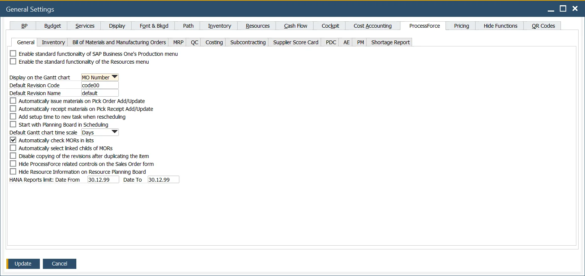
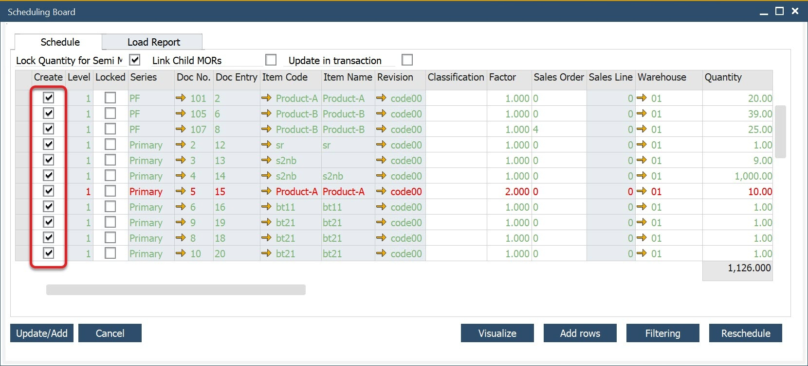
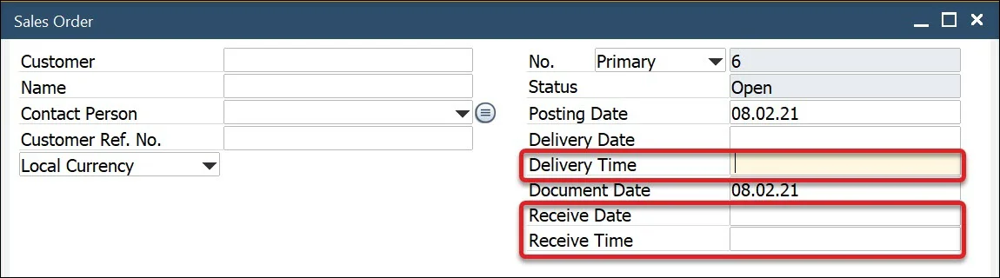
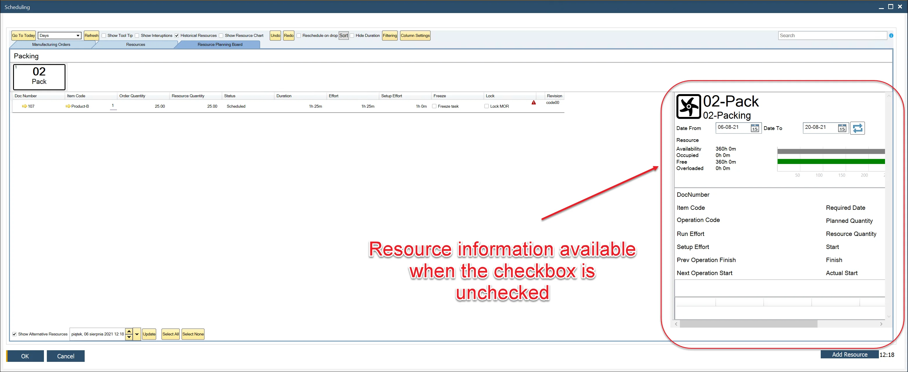

# General tab

The **General tab** provides configuration options that control core behaviors in production and resource-related processes within **SAP Business One** enhanced by **CompuTec ProcessForce**. These settings define defaults for visibility, automation, scheduling behavior, and data display preferences—impacting how production and resource information is managed and visualized.

To access General tab, navigate to:

:::info Path
Administration → System Initialization → General Settings → ProcessForce tab → General tab
:::

---

## Key Settings

The following options are available in the General tab of the CompuTec ProcessForce General Settings. These settings control system behavior related to production, scheduling, automation, and user interface visibility within SAP Business One.

- **Enable standard functionality of SAP Business One's Production menu**: Displays all default SAP Business One production menu entries alongside ProcessForce menus.
- **Enable the standard functionality of the Resources menu**: When enabled, standard SAP Business One resource menu options are visible (excluding the ProcessForce-specific Resource menu).
- **Display on the Gantt chart**: Defines what information appears by default on the Gantt chart task bars. Options include Related Resource Code, Resource Remarks, Manufacturing Order Number, Item Code, Planned Quantity, Actual Quantity, Required Date, and Priority.
    :::tip
        Use the Resource Remarks field to add custom text labels to Gantt chart progress bars.
    :::
- **Default Revision Code, Default Revision Name**: Specifies default values to be used system-wide for Revision Code and Revision Name fields.
- **Automatically issue materials on Pick Order Add/Update, Automatically receipt materials on Pick Receipt Add/Update**: Set up Auto Pick and Auto Receipt.
    

        
Click here to find out more

        

            The process flow of picking and receiving materials has been simplified by checking one or both options.

            For more details, click [here](../../manufacturing/auto-pick-issue-and-auto-pick-receipt.md)
        
            **Pick Issue**
            - Pick non-trace and batch-traced Items.
            - Click "Update "on the Pick Issue Form.
            - The system automatically creates an **Issue to Production** transaction. 
            - Pick Order is updated and set to "Close" status.
            - Documents are visible within the Manufacturing Order > Document tab.

            **Pick Receipt**
            - Record received quantities from production.  
            - Click "Update".
            - The system automatically creates a **Receipt from Production** transaction.
            - The Pick Receipt is closed.
            - Documents appear in the Manufacturing Order Document tab.
        

    

- **Add setup time to a new task when rescheduling**: When enabled, if a partially booked manufacturing task is rescheduled, the system re-applies the full setup time to the new task block.
- **Start with Planning Board in Scheduling**: Selects whether the Scheduling module opens on the [Resource Planning Board](../../scheduling/gantt-chart/resource-planning-board.md).
- **Default Gantt chart time scale**: Sets the default time scale used in Gantt views: Days, Weeks, or Months.
- **Automatically check MORs in lists**: Enables automatic selection (checkbox) of Manufacturing Order Requests (MORs) in lists—such as on the Scheduling Board.

    

- **Automatically select linked children of MORs**: Automatically enables the Link Child MORs checkbox when creating manufacturing orders from Sales Orders.
- **Disable copying of the revisions after duplicating the item**: Prevents associated revisions from being copied when duplicating an Item Master Data record.
- **Hide ProcessForce-related controls on the Sales Order form**: Hides ProcessForce-specific fields from the Sales Order header area.

    

- **Hide Resource Information on Resource Planning Board**: Hides the Resource Information panel in the Resource Planning Board to simplify the view.

    

- **HANA Reports limit: Date From, Date To**: Applies a global date filter to limit the output of specific reports based on the [Data Model](../../../administrator-guide/data-model/overview.md). Only records within the selected date range will be included in report results.

---

## Tips & Best Practices

- **Use Gantt chart labels wisely**: Choose the display field most relevant to your planners (e.g., MO Number for order-based production).
- **Avoid clutter**: Hide ProcessForce fields on Sales Orders if not used regularly by your team.
- **Default Gantt scale**: Set to Weeks or Months for long-term planning; use Days for short-run or batch-intensive operations.
- **Enable auto transactions**: Reduces clicks for production operators and streamlines document generation.

---
