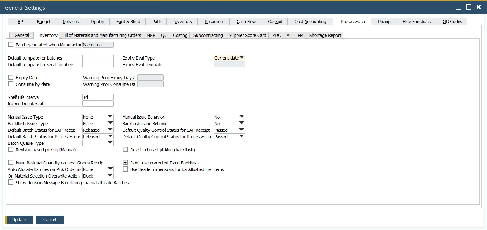

# Inventory tab

The Inventory tab contains configuration settings that control how batch and serial numbers are generated and handled, how expiry and shelf life are calculated, and how materials are issued during production. These options define the business rules for inventory allocation, quality control, and compliance during the production process.

To access Inventory tab, navigate to:

:::info Path
Administration → System Initialization → General Settings → ProcessForce tab → Inventory tab
:::

---

Below is a detailed breakdown of the key settings available in this tab.

- **Batch generated when Manufacturing Order**: If checked, you can choose one of the four options from a drop-down list to allocate a batch number when creating a Manufacturing Order or changing its status:

        - on creating MOR (not possible to use %MORDN% parameter in a template due to performance issues)
        - on changing status to Scheduled
        - on changing status to Released
        - on changing status to Started.

- **Default template for batches, Default templates for serial numbers**: Select default templates from the list. Click [here](../../item-details/batch-serial-template-definition.md) to check how to create a new Batch or Serial Number template.
- **Expiry date settings**:

        - Expiry Evaluation Type can be set by a specific date (current, start, required, end, create) or by a template. A template can be chosen from a list or modified (if it is already created). The *Expiry Eval Template* field is active when the *Expiry Eval Template* value is selected in the *Expiry Eval Type* field. Click [here](../../inventory/batch-control/batch-control-settings/extended-batch-expiry-evaluation.md) to find out more about Expiry Evaluation Type Templates.
        - A default expiry alert can be set in the *Warning Prior Expiry Days* field. It will be displayed a given number of days before the expiry date. It is only available when the *Expiry Date* check box is checked. Click [here](../../inventory/batch-control/batch-control-settings/extended-batch-expiry-evaluation.md) to find out more.
        - A default consumes alert can be set in *Warning Prior Consume Days*. It will be displayed a given number of days before the Consume Date. It is only available when Consume Date check box is checked.
        - Note that only one of these options can be active at a time: either Expiry Date or Consume By Date.
- **Shelf Life Interval**: A period used to calculate the expiry date automatically. E.g., if Shelf Life Interval is set to 30 days and a Batch record is made on June 1st, the Expiry date will be automatically charged to June 30th.
- **Inspection interval**: Defines the recurring period after which inspection alerts are raised. 
- **Manual Issue Type, Backflush Issue Type**: Determines material issuing rules for manual picking and backflushing when batch status is Locked or Not Accessible. You can find information about it [here](../../inventory/batch-control/batch-control-settings/manual-and-backflush-issue-type-configuration.md).
- **Default Batch Status for SAP Business One and ProcessForce receipt documents**: Sets batch status (Released, Locked, Not Accessible) upon receipt in SAP Business One or CompuTec ProcessForce.
        - If the status for a Batch is set to Not Accessible or Locked, a system message about this will be displayed before issuing this batch for production.
        - Click [here](../../inventory/batch-control/batch-control-settings/configuration-batch-and-quality-control-status.md) to find out more.
- **Default Quality Control Status for SAP Business One ProcessForce receipt-based documents**: Defines the quality status assigned upon receipt in SAP Business One and CompuTec ProcessForce. Options include: Failed, On Hold, Inspection, Passed, and Quality Control Testing. Click [here](../../inventory/batch-control/batch-control-settings/configuration-batch-and-quality-control-status.md) to find out more.
- **Batch Queue Type**: A type of queue used by default with batches:

        - FIFO: First In First Out
        - FEFO: First Expired First Out
        - FMFO: First Manufactured First Out.

- **Manual Issue Behavior**: Defines how materials are manually issued during production.
- **Backflush Issue Behavior**: Determines how materials are automatically issued based on production consumption.
- **Default Quality Control Status for SAP Receipt Documents**: Sets the default Quality Control status for received items in SAP.
- **Default Quality Control Status for ProcessForce Receipt Documents**: Specifies the default quality control status for received items in CompuTec ProcessForce.

    [Revision Based Picking and Backflushing](../../manufacturing/revision-based-picking-and-backflushing.md)

- **Issue Residual Quantity on next Good Receipts when possible**: Automatically reissues all rows with the Backflush issue type where the Residual Quantity is greater than zero and there is a quantity to issue (because it was not available in stock during previous receipts).
- **AutoAllocate Batches on Pick Order Include**: Selects which allocations to consider during batch auto-selection: None, Pick Orders, Sales Orders, or Both.
        - **None**: No documents are taken under consideration.
        - **On other document**: Allocations from Pick Orders are considered.
        - **Allocated**: Allocations from Sales Orders are considered.
        - **Both**: Allocations from both Pick Orders and Sales Orders are considered.

- **On Material Selection Overwrite Action**: Defines system response when selected batches exceed remaining quantity: Allow, Warn, or Block.
- **Show decision Message Box during manual allocate Batches**: Displays alert if manually selected batches deviate from the system's recommended order.
- **Don't use corrected Fixed Backflush**: If unchecked, backflush will reapply full planned quantity, even if production receipt exceeds planned output.
- **Use Header dimensions for backflushed inv. items**: Ensures that dimensions defined at the header level are inherited by backflushed inventory items.

---

For more advanced configuration topics related to batch expiry, issue logic, or quality control, refer to these topics:

- 🔗 [Extended Batch Expiry Evaluation](../../inventory/batch-control/batch-control-settings/extended-batch-expiry-evaluation.md)  
- 🔗 [Manual and Backflush Issue Type Configuration](../../inventory/batch-control/batch-control-settings/manual-and-backflush-issue-type-configuration.md)  
- 🔗 [Batch & Quality Control Status Configuration](../../inventory/batch-control/batch-control-settings/configuration-batch-and-quality-control-status.md)  
- 🔗 [Revision-Based Picking & Backflushing](../../manufacturing/revision-based-picking-and-backflushing.md)
