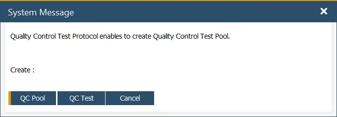

# QC tab

The Quality Control Tab in the system provides essential settings for managing quality control processes efficiently. It enables users to configure various parameters related to testing, batch release, and automated test creation. Below is an overview of the key settings and their functionalities.

---

- **QC Resource Group, QC Item**: in the Test Protocol and Quality Control Test Forms, users can define the resources and items required for testing activities, such as X-ray machines, microscopes, and tooling. The QC Resource Group and QC Item Group options allow users to select predefined groups for use in Quality Control Tests.

Click [here](../../quality-control/quality-control-configuration.md) to learn about Items and Resources for Quality Control Test configuration.

**Enable multiple test results**: select this option to record multiple results for a Test and Item Property.

>Note: When enabled, all Test and Item Property data entries will be managed using this method.

Click [here](../../quality-control/quality-control-test/multiple-test-result-record.md) to find out more about the Multiple Test Results function.

- **Release Batches on Quality Control Test Pass**: when this checkbox is selected, if a QC Test status changes to "Passed" and the document status is set to "Closed," any assigned batches (from the Quality Control Test > Transaction tab) will be marked as "Released."

- **Auto Create Quality Control Test Documents**: enabling this option allows Quality Control Tests to be generated automatically when predefined conditions are met. Click [here](../../quality-control/automatic-creation-of-quality-control-documents.md) to find out more.

- **Create Quality Control Document on MOR state**: this setting controls whether a Quality Control document is generated when a Manufacturing Order (MOR) status changes. Users can configure it to trigger at a specific status change or disable it by selecting 'No' from the drop-down list.

- **Create QC Document for Operation on MOR state**: this setting determines whether a Quality Control document should be created for an operation when a Manufacturing Order status changes. Users can configure a specific status shift or disable the feature by selecting 'No' from the drop-down list. To enable this option for a particular operation, the [QC Active checkbox](../../routings/operations.md) must be selected.

- **Update Items Properties in QC Test Protocol by updating Item Details Properties**: when this checkbox is selected, any updates made to Item Details Properties will automatically reflect in the corresponding Quality Control Test Protocol.

    

- **Force Reason if Property Test Failed**: enabling this option prevents saving or updating a Quality Control Test document if a failed Test or Item Property does not have a designated Reason Code and Name.

- **Copy QCTest Results to Batch**: when a Quality Control Test is set to "Closed," the Tested Values and Tested Reference Codes of Item Properties are transferred to the associated Batch Master Data.

If an Item Property from the Quality Control Test is not already listed in the Properties Tab of the Batch Master Data, the system automatically adds it.

- **Default state of Test / Item Properties**: users can set a default state (e.g., To be determined, Pass, Fail, Not Affected) for test and item properties within a Test Protocol or when adding properties to a Quality Control Test.

- **Enable Create Closed Quality Control Tests from Frequency Rules**: when a Quality Control Test is automatically generated based on the frequency settings in the Test Protocol’s Frequency tab, enabling this option ensures that QC Tests are created with a Closed status and a Pass result for the specified interim counts. For instance, if a QC Test is scheduled to be generated every five transactions, the system will create closed tests for the first four transactions, while a fully detailed QC Test will be generated on the fifth transaction.

- **Ask for creating Quality Control Test from QC Pool Test Protocol**: when manually creating a test from a QC Pool Test Protocol, users can choose between a single QC Test or a QC Test Pool if this option is enabled. Otherwise, the system defaults to creating a QC Test Pool.

    

- **Block Batches on Quality Control Test Fail**: prevents batches from being used if a QC Test results in failure.

---
