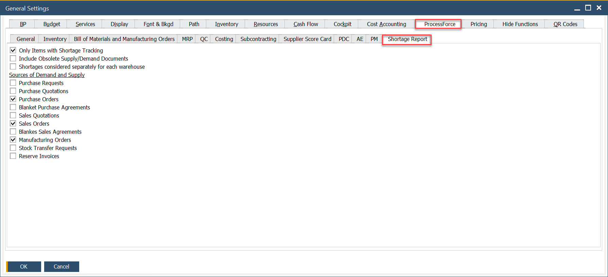

# Shortage Report tab

The **Shortage Report tab** in CompuTec ProcessForce allows you to configure how material shortages are calculated and displayed within the Shortage Report. This setup impacts how users are alerted about missing components during production planning or manufacturing order processing.

Use this configuration to align shortage logic with your company’s production processes, so you can proactively handle stock-outs or plan timely replenishments.

---

To access Shortage Report tab, navigate to:

:::info Path
Administration → System Initialization → General Settings → ProcessForce tab → Shortage Report
:::

## What is Shortage Report?

The **Shortage Report** in CompuTec ProcessForce provides a detailed analysis of missing materials required for open manufacturing orders or planned production. It compares the demand for items (based on BOMs, MO reservations, or batch requirements) with current stock levels, incoming supplies and defined safety parameters.

## Shortage Report Options

By adjusting settings in the **Shortage Report tab**, you control what counts as "available" stock, what lead times are considered and how dynamic the system should be when calculating shortages.

### 1. General Settings

1. **Only Items with Shortage Tracking**: Includes only those items that are flagged for shortage tracking in the Item Master Data.

2. **Include Obsolete Supply/Demand Documents**: If checked, the system will include outdated or closed documents - like canceled purchase orders or completed sales - in the calculation.

3. **Shortages Considered Separately for Each Warehouse**: When enabled, the system calculates shortages per warehouse independently, rather than aggregating stock across all locations. This is ideal for companies managing multiple warehouses with local fulfillment needs.

### 2. Sources of Demand and Supply

These checkboxes determine which types of documents are considered when calculating supply and demand balances:

1. **Purchase Requests**: Includes open internal requests for purchasing materials, even if they are not yet approved or converted into purchase orders.

2. **Purchase Quotations**: Adds vendor quotations as potential future supply, though they are non-binding and not yet firm commitments.

3. **Purchase Orders**: Considers all open and confirmed purchase orders as incoming supply. This is a standard setting for accurate shortage calculation.

4. **Blanket Purchase Agreements**: Factors in long-term supplier agreements, which may not have specific order quantities assigned yet but represent committed supply over time.

5. **Sales Quotations**: Includes unconfirmed sales quotations as potential demand. Helpful for forecasting but may overestimate actual needs if not managed carefully.

6. **Sales Orders**: Adds all active sales orders to the demand calculation.

7. **Blanket Sales Agreements**: Includes recurring or long-term sales commitments which may not yet have specific delivery dates or quantities but represent ongoing demand.

8. **Manufacturing Orders**: Considers open production orders. These create demand for raw materials and components and also represent future supply for finished goods.

9. **Stock Transfer Requests**: Includes planned movements of stock between warehouses.

10. **Reserve Invoices**: Includes sales that are already invoiced but not yet delivered, ensuring committed demand is reflected in the shortage report.

---

➡️ Learn more on how to configure the [Shortage Report](../../scheduling/gantt-chart/material-shortage.md)
