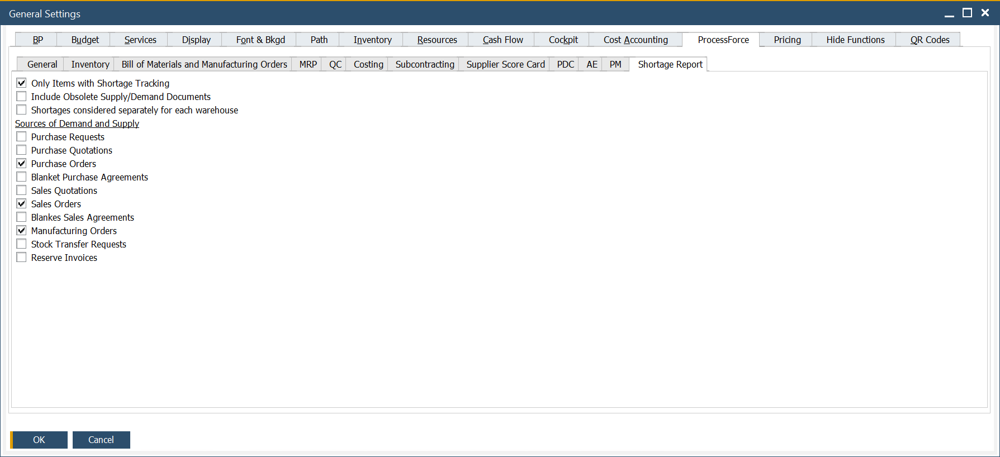

# Shortage Report tab

The **Shortage Report tab** in CompuTec ProcessForce allows you to configure how material shortages are calculated and displayed within the Shortage Report. This setup impacts how users are alerted about missing components during production planning or manufacturing order processing.

Use this configuration to align shortage logic with your company’s production processes, so you can proactively handle stock-outs or plan timely replenishments.

---

To access Shortage Report tab, navigate to:

:::info Path
Administration → System Initialization → General Settings → ProcessForce tab → Shortage Report
:::

## What is Shortage Report?

The **Shortage Report** in CompuTec ProcessForce provides a detailed analysis of missing materials required for open manufacturing orders or planned production. It compares the demand for items (based on BOMs, MO reservations, or batch requirements) with current stock levels, incoming supplies and defined safety parameters.

By adjusting settings in the **Shortage Report tab**, you control what counts as "available" stock, what lead times are considered and how dynamic the system should be when calculating shortages.

---

For detailed instructions on configuring the Shortage Report, [refer here](../../scheduling/gantt-chart/material-shortage.md)
